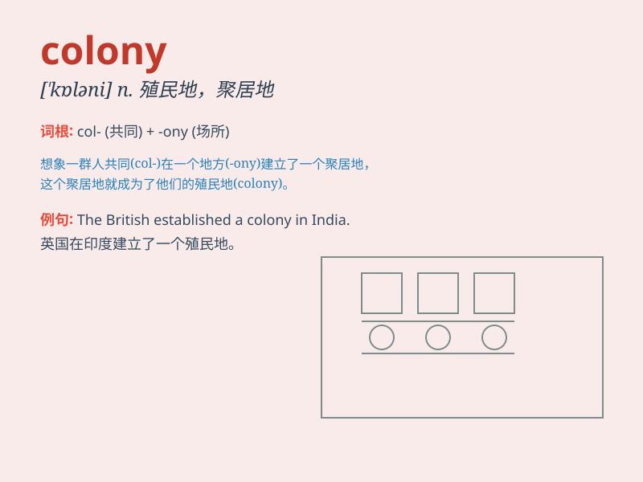

## colony

**英音:** _[\'kɒlənɪ]_ **美音:** _[\'kɑləni]_

**译义:** *n.殖民地,侨民,(聚居的)一群同业,一批同行,(生物)群体*

### 短语

+ **bee colony:** _蜂群_

+ **colony collapse:** _蜂群崩溃_

+ **ant colony:** _蚁群_

+ **bacterial colony:** _细菌菌落_

+ **colony formation:** _群体形成_

### 例句

#### 例句1

> **The ants have built a large colony under the ground.**

**中文翻译:** 蚂蚁在地下建立了一个大的聚居地。

**单词释义:** 聚居地；殖民地

#### 例句2

> **Australia was once a British colony.**

**中文翻译:** 澳大利亚曾经是英国的殖民地。

**单词释义:** 殖民地

#### 例句3

> **A colony of seals was basking in the sun on the rocks.**

**中文翻译:** 一群海豹在岩石上晒太阳。

**单词释义:** 群；群体

### 背诵小故事

>
想象一下，一群勤劳的小蚂蚁离开了原来的蚁巢，去寻找新的家园。它们最终找到了一个地方，建立了一个新的群体，这个新的群体就像一个
colony 。在那里，它们共同生活、工作，一起发展壮大。

**想象一群蚂蚁建立新群体的故事来辅助记忆单词
colony（殖民地；群体）**

### 图义

