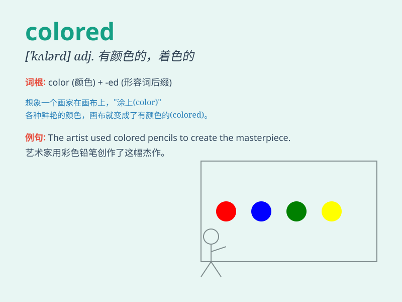

## colored

**英音:** _[ˈkʌləd]_ **美音:** _[ˈkʌlərd]_

**译义:** *adj.(指人种)有色的*

### 短语

+ **colored pencils:** _彩色铅笔_

+ **colored paper:** _彩色纸_

+ **colored lights:** _彩灯_

+ **colored flags:** _彩旗_

+ **colored glass:** _彩色玻璃_

### 例句

#### 例句1

> **The sky was colored a beautiful shade of pink at sunset.**

**中文翻译:** 日落时天空被染成了美丽的粉色。

**单词释义:** 被着色；被渲染

#### 例句2

> **She wore a colored dress to the party.**

**中文翻译:** 她穿着一条彩色的连衣裙去参加聚会。

**单词释义:** 彩色的

#### 例句3

> **The artist used colored pencils to draw the picture.**

**中文翻译:** 这位艺术家使用彩色铅笔来画画。

**单词释义:** 彩色的

### 背诵小故事

> A little girl was drawing with colored pencils. She used red for
apples, blue for sky, and green for grass. The beautiful colors made her
picture wonderful. Remember, \'colored\' means having color.

**一个小女孩正在用彩色铅笔画画。她用红色画苹果，蓝色画天空，绿色画草地。美丽的颜色让她的画很棒。记住，\'colored\'意思是有颜色的。**

### 图义

