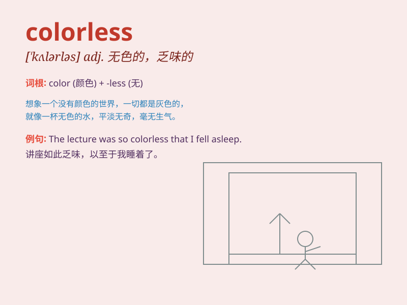

## colorless

**英音:** _[\'kʌləlɪs]_ **美音:** _[\'kʌlɚlɪs]_

**译义:** *adj.无色的,无趣味的*

### 短语

+ **colorless liquid:** _无色液体_

+ **colorless gas:** _无色气体_

+ **colorless crystal:** _无色晶体_

+ **colorless solution:** _无色溶液_

+ **colorless diamond:** _无色钻石_

### 例句

#### 例句1

> **The sky was colorless on that cloudy day.**

**中文翻译:** 那个阴天，天空是无色的。

**单词释义:** 无色的；苍白的

#### 例句2

> **The dress she wore was colorless and plain.**

**中文翻译:** 她穿的衣服是无色的，朴素的。

**单词释义:** 单调的；无特色的

#### 例句3

> **His face looked colorless after the illness.**

**中文翻译:** 病后他的脸色毫无血色。

**单词释义:** 苍白的；无血色的

### 背诵小故事

> Once upon a time, there was a magic paint. But it was colorless and
couldn\'t make beautiful pictures. One day, a fairy gave it color and it
became wonderful. So, \'colorless\' means without color.

**从前，有一瓶神奇的颜料。但它是无色的，不能画出美丽的画。有一天，一位仙女给了它颜色，它变得很棒。所以，\'colorless\'意思是没有颜色的。**

### 图义

