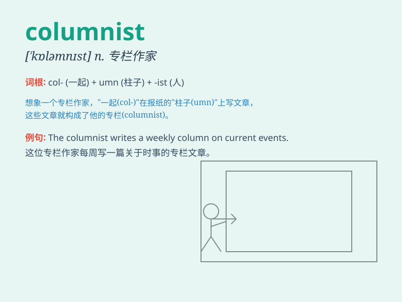

## columnist

**英音:** _[\'kɒləm(n)ɪst]_ **美音:** _[\'kɑləmnɪst]_

**译义:** *n.专栏作家*

### 短语

+ **political columnist:** _政治专栏作家_

+ **sports columnist:** _体育专栏作家_

+ **fashion columnist:** _时尚专栏作家_

+ **opinion columnist:** _评论专栏作家_

+ **celebrity columnist:** _名人专栏作家_

### 例句

#### 例句1

> **The columnist wrote a scathing critique of the new policy.**

**中文翻译:** 这位专栏作家写了一篇对新政策的严厉批评。

**单词释义:** 专栏作家

#### 例句2

> **She has become a well-known columnist in the field of
fashion.**

**中文翻译:** 她已成为时尚领域一位知名的专栏作家。

**单词释义:** 专栏作家

#### 例句3

> **The newspaper hired a new columnist to cover local politics.**

**中文翻译:** 这家报纸聘请了一位新的专栏作家来报道当地政治。

**单词释义:** 专栏作家

### 背诵小故事

> A young journalist dreamed of becoming a famous columnist. One day,
she got a chance to write a column about a big event. Her unique views
made her column popular, and she finally achieved her dream.

**一位年轻的记者梦想成为著名的专栏作家。有一天，她得到了一个机会为一件大事写专栏。她独特的观点使她的专栏受欢迎，最终她实现了梦想。**

### 图义

