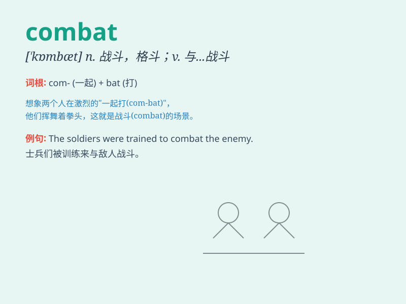

## combat

**英音:** _[\'kɒmbæt; \'kʌm-]_ **美音:** _[\'kɑmbæt]_

**译义:** *n.战斗,格斗v.战斗,搏斗,抗击*

### 短语

+ **combat troops:** _作战部队_

+ **combat fatigue:** _战斗疲劳_

+ **combat crime:** _打击犯罪_

+ **combat poverty:** _与贫困作斗争_

+ **combat skills:** _战斗技能_

### 例句

#### 例句1

> **The soldiers were engaged in combat with the enemy.**

**中文翻译:** 士兵们与敌人正在交战。

**单词释义:** 战斗；格斗

#### 例句2

> **She learned martial arts to combat her fear of being
attacked.**

**中文翻译:** 她学习武术以对抗被攻击的恐惧。

**单词释义:** 对抗；与\...斗争

#### 例句3

> **The new medicine is designed to combat cancer.**

**中文翻译:** 这种新药是为了抗击癌症而设计的。

**单词释义:** 抗击；制止

### 背诵小故事

> A brave soldier entered the combat zone. He faced many enemies but
didn\'t back down. He fought bravely to protect his country. \'Combat\'
means to fight or struggle against something or someone.

**一位勇敢的士兵进入战斗区域。他面对众多敌人却毫不退缩。他英勇作战以保卫国家。'combat'意思是与某物或某人战斗或斗争。**

### 图义

