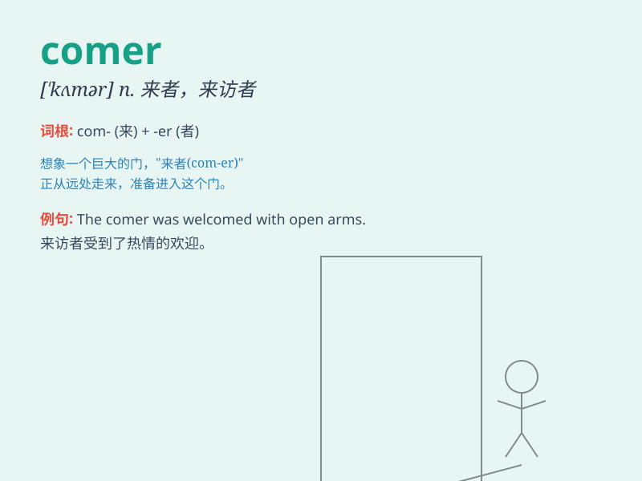

## comer

**英音:** _[\'kʌmə]_ **美音:** _[\'kʌmɚ]_

**译义:** *n.来者,新来者,有希望者*

### 短语

+ **new comer:** _新来的人；新手_

+ **late comer:** _迟到者；后来者_

+ **fast comer:** _快速到来的人_

+ **strong comer:** _强有力的竞争者_

+ **frequent comer:** _常客_

### 例句

#### 例句1

> **A new comer has joined our team.**

**中文翻译:** 一位新成员加入了我们的团队。

**单词释义:** 新来的人

#### 例句2

> **The early comer gets the best seat.**

**中文翻译:** 来得早的人能得到最好的座位。

**单词释义:** 来得早的人

#### 例句3

> **She is a strong comer in the race.**

**中文翻译:** 她在比赛中是一位强有力的竞争者。

**单词释义:** 竞争者

### 背诵小故事

> A little rabbit was a new comer to the forest. It was nervous but
curious. It met other animals and slowly became a familiar face. The
rabbit was a brave comer, ready to explore its new home.

**一只小兔子是森林的新来者。它很紧张但又充满好奇。它遇到了其他动物，慢慢地变成了熟面孔。这只兔子是个勇敢的来者，准备探索它的新家。**

### 图义

