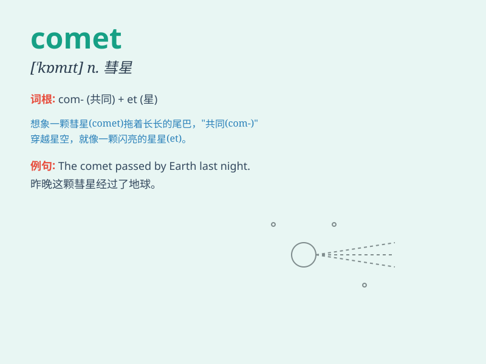

## comet

**英音:** _[\'kɒmɪt]_ **美音:** _[\'kɑmət]_

**译义:** *n.彗星*

### 短语

+ **Halley\'s Comet:** _哈雷彗星_

+ **comet tail:** _彗尾_

+ **comet nucleus:** _彗核_

+ **comet shower:** _流星雨_

+ **periodic comet:** _周期彗星_

### 例句

#### 例句1

> **A bright comet appeared in the sky last night.**

**中文翻译:** 昨晚天空中出现了一颗明亮的彗星。

**单词释义:** 彗星

#### 例句2

> **The comet streaked across the sky with a long tail.**

**中文翻译:** 这颗彗星拖着长长的尾巴划过天空。

**单词释义:** 彗星

#### 例句3

> **Scientists are studying the composition of the comet.**

**中文翻译:** 科学家们正在研究这颗彗星的组成成分。

**单词释义:** 彗星

### 背诵小故事

> One night, a little boy was looking up at the sky. Suddenly, he saw a
bright object with a long tail. His father told him it was a comet. The
boy was so amazed and never forgot that magical moment.

**一天晚上，一个小男孩抬头看天空。突然，他看到一个带有长尾巴的明亮物体。他爸爸告诉他那是一颗彗星。小男孩非常惊讶，永远忘不了那个神奇的时刻。**

### 图义

