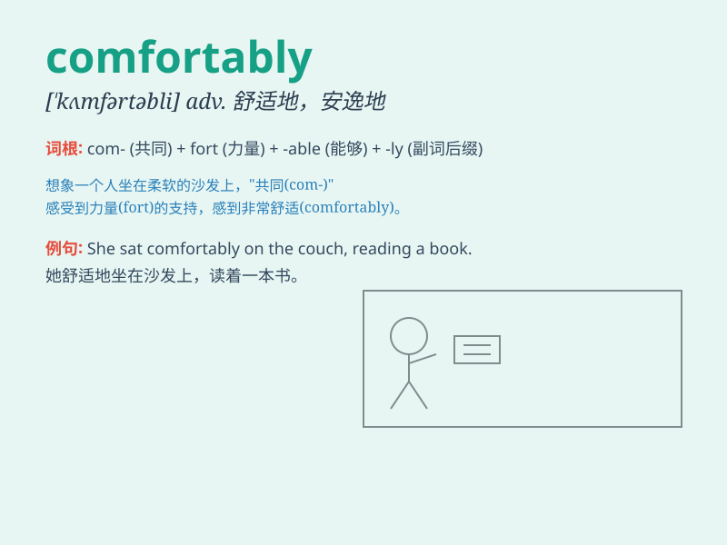

## comfortably

**英音:** _[ˈkʌmftəbli]_ **美音:** _[ˈkʌmftəbli]_

**译义:** *adv.安乐地,舒适地,充裕地*

### 短语

+ **sit comfortably:** _舒适地坐着_

+ **sleep comfortably:** _舒适地睡觉_

+ **live comfortably:** _舒适地生活_

+ **dress comfortably:** _穿着舒适_

+ **travel comfortably:** _舒适地旅行_

### 例句

#### 例句1

> **He sat comfortably in the armchair, reading a book.**

**中文翻译:** 他舒适地坐在扶手椅上看书。

**单词释义:** 舒适地

#### 例句2

> **The team won the game comfortably.**

**中文翻译:** 这个队轻松地赢得了比赛。

**单词释义:** 轻松地

#### 例句3

> **She can sleep comfortably in this bed.**

**中文翻译:** 她在这张床上能睡得舒服。

**单词释义:** 舒服地

### 背诵小故事

> One day, I was very tired after a long walk. But when I sat on a soft
sofa comfortably, I felt all my exhaustion fade away. The sofa gave me a
great sense of comfort and relaxation.

**有一天，我走了很长的路后非常累。但当我舒服地坐在柔软的沙发上时，我感到所有的疲惫都消失了。沙发给了我极大的舒适和放松感。**

### 图义

