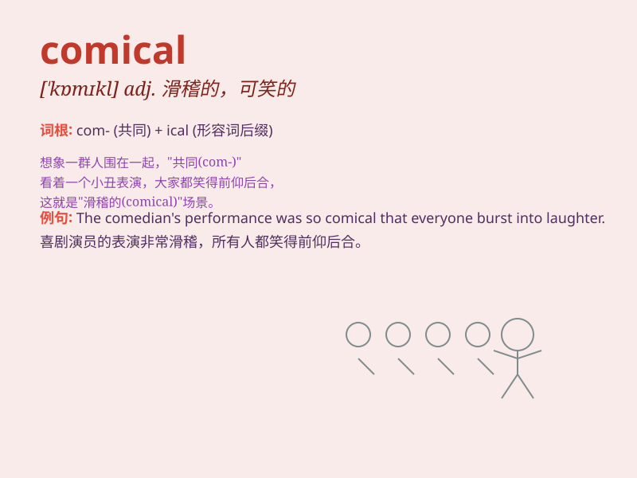

## comical

**英音:** _[\'kɒmɪk(ə)l]_ **美音:** _[\'kɑmɪkl]_

**译义:** *adj.好笑的,滑稽的*

### 短语

+ **comical situation:** _滑稽的局面_

+ **comical expression:** _滑稽的表情_

+ **comical story:** _滑稽的故事_

+ **comical character:** _滑稽的角色_

+ **comical scene:** _滑稽的场景_

### 例句

#### 例句1

> **The clown\'s performance was comical and had the audience in
stitches.**

**中文翻译:** 小丑的表演很滑稽，让观众捧腹大笑。

**单词释义:** 滑稽的，好笑的

#### 例句2

> **His comical expressions made everyone laugh at the party.**

**中文翻译:** 他滑稽的表情让聚会上的每个人都笑了。

**单词释义:** 滑稽的，引人发笑的

#### 例句3

> **The situation turned comical when the dog wore the hat.**

**中文翻译:** 当狗戴上帽子时，情况变得很滑稽。

**单词释义:** 滑稽有趣的

### 背诵小故事

> One day, I went to a circus. There was a clown who had a comical face
and did funny moves. Everyone laughed loudly. His performance was so
comical that it made our day full of joy.

**有一天，我去了一个马戏团。有一个小丑，他有一张滑稽的脸，还做着有趣的动作。每个人都大声笑了。他的表演太滑稽了，让我们这一天都充满了欢乐。**

### 图义

