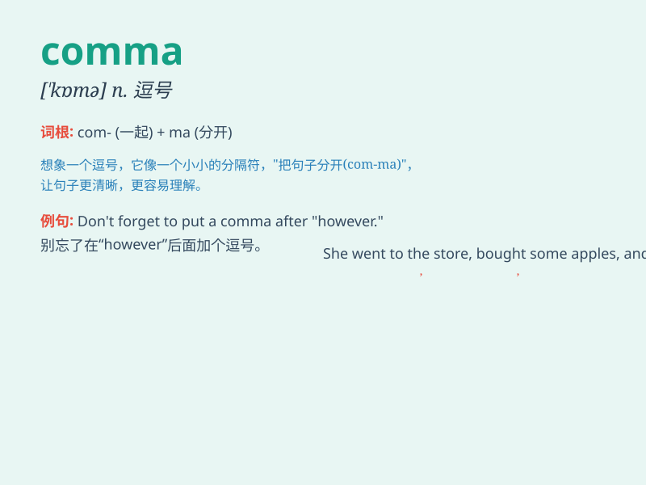

## comma

**英音:** _[\'kɒmə]_ **美音:** _[\'kɑmə]_

**译义:** *n.逗点,逗号*

### 短语

+ **comma splice:**
_逗号粘连（指在两个完整的句子之间仅用逗号连接而没有使用适当的连词）_

+ **serial comma:**
_序列逗号（在列举三个或更多项目时，在倒数第二个项目之前使用的逗号）_

+ **Oxford comma:**
_牛津逗号（在列举三个或更多项目时，在最后一个'and'或'or'之前使用的逗号）_

+ **comma rule:** _逗号规则_

+ **comma usage:** _逗号的用法_

### 例句

#### 例句1

> **A comma is used to separate items in a list.**

**中文翻译:** 逗号用于分隔列表中的项目。

**单词释义:** 逗号

#### 例句2

> **Please add a comma after this word.**

**中文翻译:** 请在这个词后面加一个逗号。

**单词释义:** 逗号

#### 例句3

> **The comma in this sentence is important for clarity.**

**中文翻译:** 这个句子中的逗号对清晰表达很重要。

**单词释义:** 逗号

### 背诵小故事

> One day, a little comma was feeling lost in a long sentence. It
thought it was too small and unimportant. But when it was removed, the
meaning of the sentence changed completely. Then the comma realized its
great value.

**有一天，一个小逗号在一个长句子里感到失落。它觉得自己太小太不重要了。但当它被去掉时，句子的意思完全变了。然后逗号意识到了自己的巨大价值。**

### 图义

