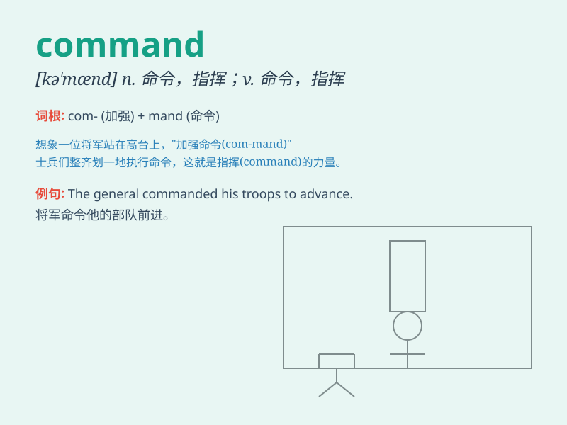

## command

**英音:** _[kə\'mɑːnd]_ **美音:** _[kə\'mænd]_

**译义:** *n.命令,掌握,司令部v.命令,指挥,克制,支配,博得,俯临*

### 短语

+ **in command:** _负责；指挥_

+ **take command:** _开始指挥；担任指挥_

+ **command of:** _掌握；对......精通_

+ **under one\'s command:** _在某人的指挥下_

+ **have a good command of:** _精通；对......运用自如_

### 例句

#### 例句1

> **The general commanded his troops to advance.**

**中文翻译:** 将军命令他的部队前进。

**单词释义:** 命令

#### 例句2

> **She has a good command of French.**

**中文翻译:** 她精通法语。

**单词释义:** 精通；掌握

#### 例句3

> **The remote control commands the TV to switch on.**

**中文翻译:** 遥控器指挥电视开机。

**单词释义:** 指挥；控制

### 背诵小故事

> A brave general commanded his soldiers to attack the enemy\'s castle.
With his strong and confident voice, everyone knew exactly what to do.
The word \'command\' means to give orders or have authority over
something.

**一位勇敢的将军指挥他的士兵攻打敌人的城堡。凭借他强有力且自信的声音，每个人都清楚地知道该做什么。单词\'command\'意思是下达命令或对某事有权威。**

### 图义

