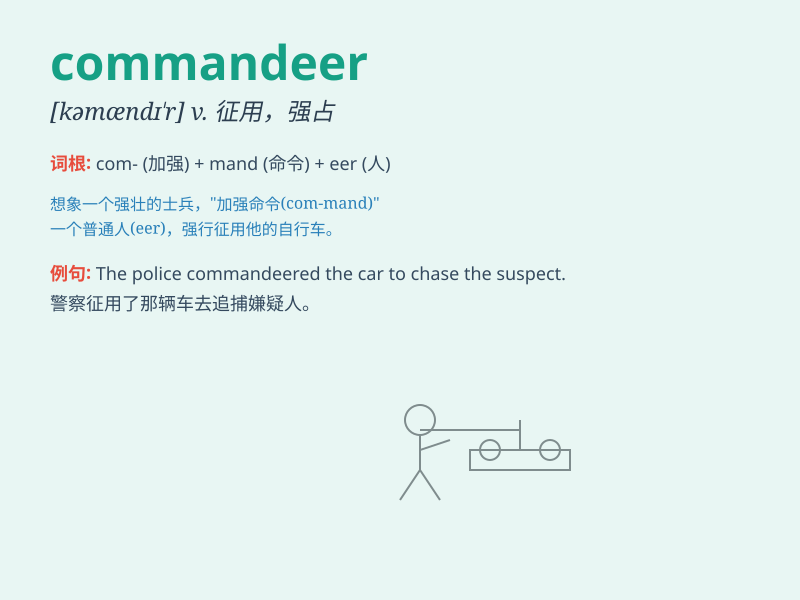

## commandeer

**英音:** _[,kɒmən\'dɪə]_ **美音:** _[,kɑmən\'dɪr]_

**译义:** *vt.征募,霸占*

### 短语

+ **commandeer a vehicle:** _强征车辆_

+ **commandeer resources:** _征用资源_

+ **commandeer supplies:** _强占物资_

+ **commandeer property:** _强占财产_

+ **commandeer a building:** _强占一栋建筑物_

### 例句

#### 例句1

> **The soldiers commandeered the civilian vehicles for military
use.**

**中文翻译:** 士兵们征用民用车辆用于军事用途。

**单词释义:** 征用

#### 例句2

> **The gangsters commandeered the warehouse to store their stolen
goods.**

**中文翻译:** 歹徒们强占了仓库来存放他们偷来的货物。

**单词释义:** 强占

#### 例句3

> **During the emergency, the government was authorized to commandeer
private resources.**

**中文翻译:** 在紧急情况下，政府被授权征用私人资源。

**单词释义:** 征用

### 背诵小故事

> One day, during a war, the army needed more vehicles. So, they
commandeered all the cars in the town to transport soldiers and
supplies. It means to take control of something forcefully for a
specific purpose.

**有一天，在战争期间，军队需要更多的车辆。于是，他们强行征用了镇上所有的汽车来运输士兵和物资。这个词的意思是为了特定目的强行控制某物。**

### 图义

