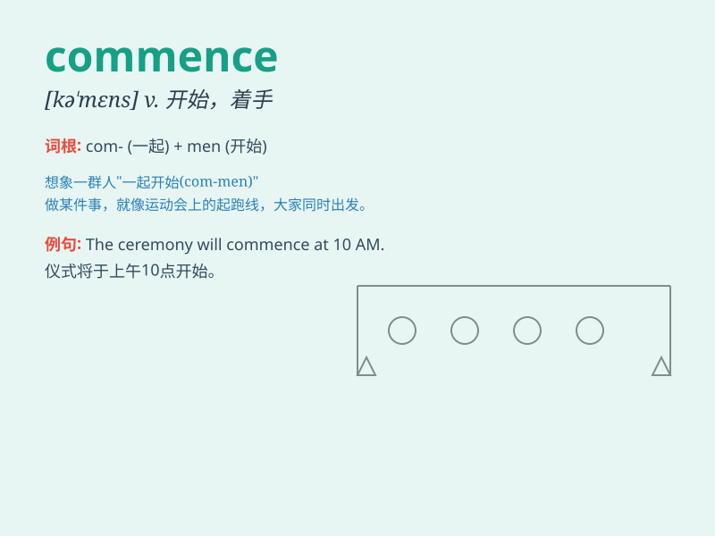

## commence

**英音:** _[kə\'mens]_ **美音:** _[kə\'mɛns]_

**译义:** *v.开始,着手*

### 短语

+ **commence business:** _开始营业_

+ **commence work:** _开始工作_

+ **commence studies:** _开始学习_

+ **commence proceedings:** _提起诉讼_

+ **commence negotiations:** _开始谈判_

### 例句

#### 例句1

> **The meeting will commence at 9 o\'clock.**

**中文翻译:** 会议将于9点开始。

**单词释义:** 开始

#### 例句2

> **The project commenced last month and is expected to be completed
in six months.**

**中文翻译:** 该项目于上个月开始，预计将在六个月内完成。

**单词释义:** 开始

#### 例句3

> **She commenced her speech with a joke.**

**中文翻译:** 她以一个笑话开始了演讲。

**单词释义:** 开始

### 背诵小故事

> A group of students were very nervous before the exam. But when the
bell rang, they commenced writing answers quickly. It means to begin or
start.

**一群学生在考试前非常紧张。但当铃声响起，他们就开始快速答题。这个单词意思是开始、着手。**

### 图义

