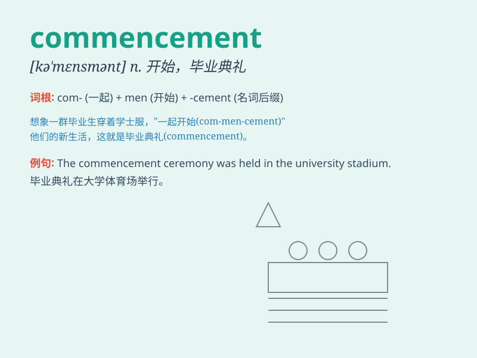

## commencement

**英音:** _[kə\'mensm(ə)nt]_ **美音:** _[kə\'mɛnsmənt]_

**译义:** *n.开始,毕业典礼*

### 短语

+ **commencement ceremony:** _毕业典礼_

+ **commencement date:** _开始日期_

+ **commencement speech:** _开幕致辞_

+ **commencement exercises:** _毕业典礼活动_

+ **commencement of business:** _业务开始_

### 例句

#### 例句1

> **The commencement of the concert was delayed due to technical
issues.**

**中文翻译:** 由于技术问题，音乐会的开始时间被推迟。

**单词释义:** 开始

#### 例句2

> **The commencement of the new school year is always an exciting
time.**

**中文翻译:** 新学年的开始总是一个令人兴奋的时刻。

**单词释义:** 开始

#### 例句3

> **The commencement of the project will require a lot of
planning.**

**中文翻译:** 该项目的启动需要大量的规划。

**单词释义:** 开始

### 背诵小故事

>
想象一下，学校的毕业典礼（commencement）上，同学们兴奋地等待新旅程的开始。校长宣布典礼开始，这就是commencement，标志着一段学习的结束和新生活的开启。

**想象学校毕业典礼上，校长宣布开始，这就是\'commencement\'，表示开始、开端**

### 图义

