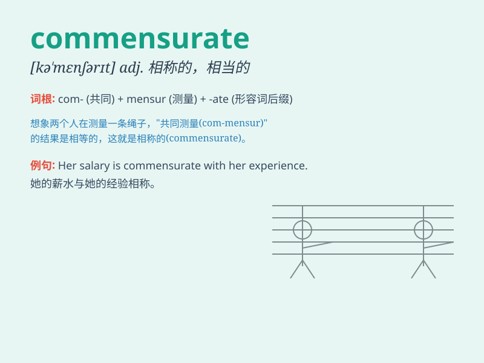

## commensurate

**英音:** _[kə\'menʃ(ə)rət; -sjə-]_ **美音:**
_[kəˈmɛnsərɪt, -ʃə-]_

**译义:** *adj.相称的,相当的*

### 短语

+ **commensurate with:** _与\...相称；与\...相当_

+ **be commensurate to:** _与\...成比例；与\...相称_

+ **commensurate reward:** _相称的报酬_

+ **commensurate effort:** _相当的努力_

+ **commensurate responsibility:** _相应的责任_

### 例句

#### 例句1

> **The salary is commensurate with the amount of work you do.**

**中文翻译:** 薪水与你所做的工作量相称。

**单词释义:** 与\...\...相称

#### 例句2

> **His punishment was not commensurate to the severity of his
crime.**

**中文翻译:** 他所受到的惩罚与其罪行的严重程度不相称。

**单词释义:** 与\...\...相称

#### 例句3

> **The risks involved should be commensurate with the potential
rewards.**

**中文翻译:** 所涉及的风险应与潜在的回报相称。

**单词释义:** 与\...\...相称

### 背诵小故事

> A hardworking student expected a salary commensurate with his
efforts. But the company didn\'t offer it. He was very disappointed. It
means proportionate or corresponding.

**一个勤奋的学生期望得到与他的努力相称的薪水。但公司没有提供。他非常失望。这个单词意思是成比例的；相称的；相应的。**

### 图义

