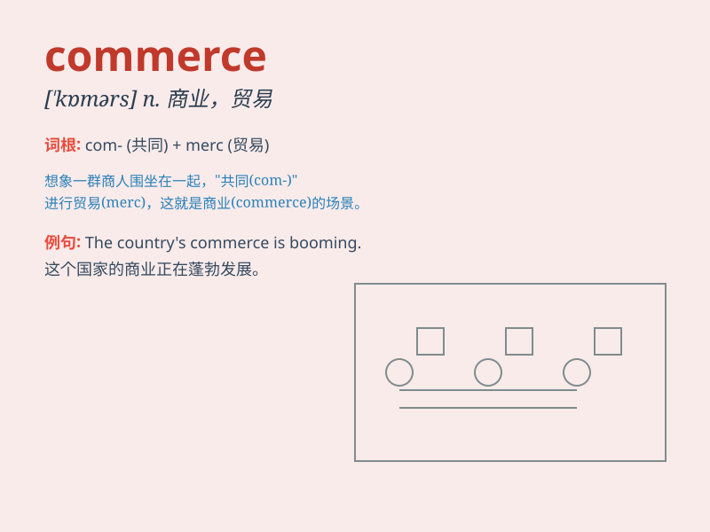

## commerce

**英音:** _[\'kɒmɜːs]_ **美音:** _[\'kɑmɝs]_

**译义:** *n.商业*

### 短语

+ **international commerce:** _国际商务_

+ **domestic commerce:** _国内商务_

+ **electronic commerce:** _电子商务_

+ **commerce department:** _商务部_

+ **commerce minister:** _商务部长_

### 例句

#### 例句1

> **International commerce has grown rapidly in recent years.**

**中文翻译:** 近年来，国际贸易快速增长。

**单词释义:** 贸易；商业

#### 例句2

> **The government is taking measures to promote domestic
commerce.**

**中文翻译:** 政府正在采取措施促进国内商业。

**单词释义:** 商业

#### 例句3

> **E-commerce has changed the way people shop.**

**中文翻译:** 电子商务改变了人们的购物方式。

**单词释义:** 商业；商务

### 背诵小故事

> A young entrepreneur started a small business. Through hard work and
smart strategies, his trade grew and he formed many partnerships. His
success was all about commerce - the exchange of goods and services.

**一位年轻的企业家创办了一家小企业。通过努力工作和明智的策略，他的贸易不断增长，并建立了许多合作伙伴关系。他的成功都与商业------商品和服务的交换有关。**

### 图义

