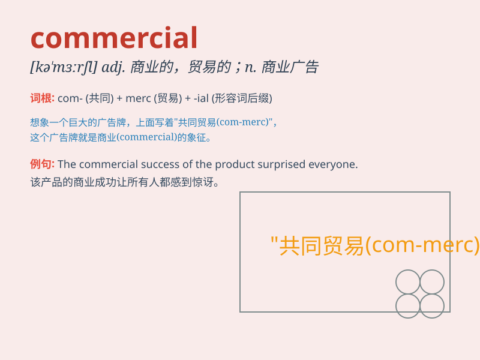

## commercial

**英音:** _[kə\'mɜːʃ(ə)l]_ **美音:** _[kə\'mɝʃəl]_

**译义:** *adj.商业的,贸易的*

### 短语

+ **commercial bank:** _商业银行_

+ **commercial center:** _商业中心_

+ **commercial vehicle:** _商用车辆_

+ **commercial law:** _商法_

+ **commercial value:** _商业价值_

### 例句

#### 例句1

> **The commercial district is always crowded during weekends.**

**中文翻译:** 周末的商业区总是人头攒动。

**单词释义:** 商业的

#### 例句2

> **This is a commercial airline.**

**中文翻译:** 这是一家商业航空公司。

**单词释义:** 商业的

#### 例句3

> **The new product has great commercial potential.**

**中文翻译:** 新产品具有巨大的商业潜力。

**单词释义:** 商业的；商务的

### 背诵小故事

> A young entrepreneur wanted to start a business. He needed a
commercial space to sell his products. After a long search, he found the
perfect place and his business thrived. \'Commercial\' means related to
business and trade.

**一位年轻的企业家想要创业。他需要一个商业空间来销售他的产品。经过长时间的寻找，他找到了完美的地方，他的生意兴隆起来。\'commercial\'意思是与商业和贸易有关的。**

### 图义

