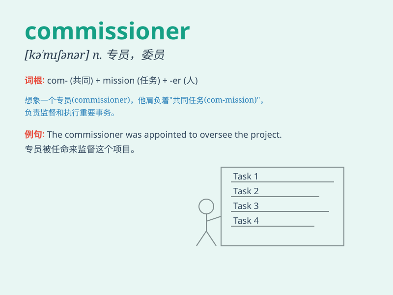

## commissioner

**英音:** _[kə\'mɪʃ(ə)nə]_ **美音:** _[kə\'mɪʃənɚ]_

**译义:** *n.委员,专员*

### 短语

+ **high commissioner:** _高级专员_

+ **commissioner general:** _总警监_

+ **police commissioner:** _警察局长_

+ **commissioner of customs:** _海关关长_

+ **commissioner of oaths:** _监誓员_

### 例句

#### 例句1

> **The commissioner of police attended the press conference.**

**中文翻译:** 警务处处长出席新闻发布会。

**单词释义:** 专员；长官

#### 例句2

> **The commissioner for human rights is visiting the country.**

**中文翻译:** 人权专员正在访问该国。

**单词释义:** 专员

#### 例句3

> **The sports commissioner made some important decisions.**

**中文翻译:** 体育委员做出了一些重要决定。

**单词释义:** 专员

### 背诵小故事

> A brave man was chosen as the commissioner. His task was to solve the
mystery of stolen treasures. With great courage and wisdom, he finally
found the clues and completed the mission.

**一位勇敢的人被选为专员。他的任务是解开被盗宝藏之谜。凭借巨大的勇气和智慧，他最终找到了线索并完成了使命。**

### 图义

