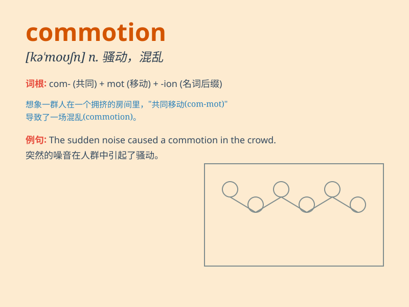

## commotion

**英音:** _[kə\'məʊʃ(ə)n]_ **美音:** _[kə\'moʃən]_

**译义:** *n.骚动,暴乱*

### 短语

+ **cause a commotion:** _引起骚乱_

+ **in commotion:** _处于骚乱中_

+ **create commotion:** _制造骚乱_

+ **great commotion:** _巨大的骚乱_

+ **public commotion:** _公众骚乱_

### 例句

#### 例句1

> **The commotion in the market attracted a lot of attention.**

**中文翻译:** 市场的骚动引起了很多人的关注。

**单词释义:** 骚乱；动乱

#### 例句2

> **There was a commotion when the famous singer arrived.**

**中文翻译:** 当这位著名歌手到来时，引起了一阵骚动。

**单词释义:** 骚动；喧闹

#### 例句3

> **The commotion at the football stadium was out of control.**

**中文翻译:** 足球场内的骚乱已经失控。

**单词释义:** 混乱；喧哗

### 背诵小故事

> One day, a commotion happened in the quiet town. A group of monkeys
escaped from the zoo and ran around, causing chaos. People were shouting
and running everywhere. Such a scene was truly a commotion.

**有一天，在安静的小镇上发生了一场骚乱。一群猴子从动物园逃了出来，到处乱跑，造成了混乱。人们到处叫喊着奔跑。这样的场景真是一场骚乱。**

### 图义

