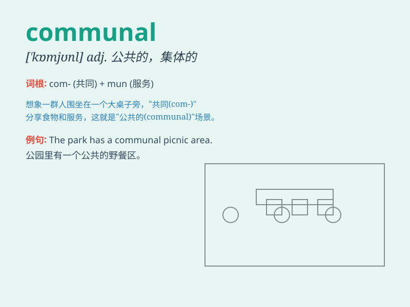

## communal

**英音:** _[\'kɒmjʊn(ə)l; kə\'mjuː-]_ **美音:**
_[kəˈmjunəl]_

**译义:** *adj.公共的,公社的*

### 短语

+ **communal living:** _集体生活_

+ **communal facilities:** _公共设施_

+ **communal garden:** _公共花园_

+ **communal harmony:** _社区和谐_

+ **communal violence:** _群体暴力_

### 例句

#### 例句1

> **The communal garden is shared by all the residents of the
apartment complex.**

**中文翻译:** 公共花园由公寓大楼的所有居民共用。

**单词释义:** 公共的；共有的

#### 例句2

> **There was a communal effort to clean up the neighborhood after
the storm.**

**中文翻译:** 暴风雨过后，大家共同努力清理社区。

**单词释义:** 共同的；集体的

#### 例句3

> **The communal bathroom was not very clean.**

**中文翻译:** 公共浴室不是很干净。

**单词释义:** 公共的

### 背诵小故事

> In a communal garden, people shared their tools and plants. They
worked together, enjoying the common space. Communal means shared by all
members of a community.

**在一个公共花园里，人们共享他们的工具和植物。他们一起劳作，享受着共同的空间。Communal
意思是社区全体成员共有的。**

### 图义

