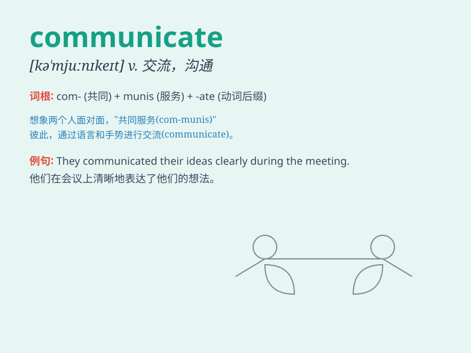

## communicate

**英音:** _[kə\'mjuːnɪkeɪt]_ **美音:** _[kə\'mjunɪket]_

**译义:** *v.沟通,通信,(房间、道路、花园等)相通,传达,感染*

### 短语

+ **communicate with:** _与\...\...交流；与\...\...沟通_

+ **communicate effectively:** _有效地交流_

+ **communicate clearly:** _清晰地交流_

+ **communicate information:** _交流信息_

+ **communicate ideas:** _交流想法_

### 例句

#### 例句1

> **We communicate with each other by email.**

**中文翻译:** 我们通过电子邮件相互沟通。

**单词释义:** 交流；沟通

#### 例句2

> **She is good at communicating her ideas clearly.**

**中文翻译:** 她善于清晰地表达自己的想法。

**单词释义:** 表达；传达

#### 例句3

> **Television is an effective means of communicating
information.**

**中文翻译:** 电视是传播信息的有效手段。

**单词释义:** 传达；传递

### 背诵小故事

> A little bird wanted to communicate with a big elephant. It flew
around and chirped loudly. The elephant finally understood through its
actions and sounds. Communicating can be in many ways!

**一只小鸟想要和一头大象交流。它飞来飞去并大声鸣叫。大象最终通过它的动作和声音明白了。交流可以有很多方式！**

### 图义

