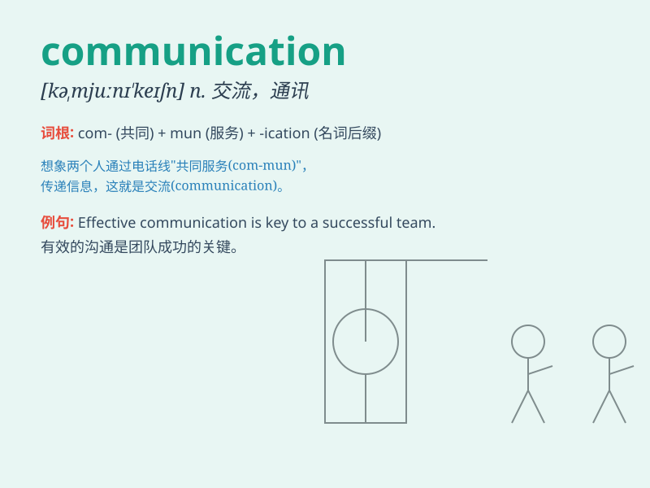

## communication

**英音:** _[kəmjuːnɪ\'keɪʃ(ə)n]_ **美音:**
_[kə,mjunɪ\'keʃən]_

**译义:** *n.传达,信息,交通,通讯*

### 短语

+ **communication skills:** _沟通技巧_

+ **communication channel:** _沟通渠道_

+ **effective communication:** _有效的沟通_

+ **verbal communication:** _口头交流_

+ **non-verbal communication:** _非言语交际_

### 例句

#### 例句1

> **Good communication is essential in a relationship.**

**中文翻译:** 良好的沟通对于一段关系至关重要。

**单词释义:** 沟通；交流

#### 例句2

> **The company has improved its internal communication system.**

**中文翻译:** 公司完善了内部沟通体系。

**单词释义:** 交流系统

#### 例句3

> **Effective communication skills can help you succeed in your
career.**

**中文翻译:** 有效的沟通技巧可以帮助您取得职业成功。

**单词释义:** 沟通技巧

### 背诵小故事

> One day, a little bird was lost. It needed communication to find its
way home. It chirped loudly, hoping other birds could understand and
help. Finally, with successful communication, it returned safely.

**有一天，一只小鸟迷路了。它需要交流来找到回家的路。它大声鸣叫，希望其他鸟儿能够理解并帮助它。最终，通过成功的交流，它安全地回了家。**

### 图义

