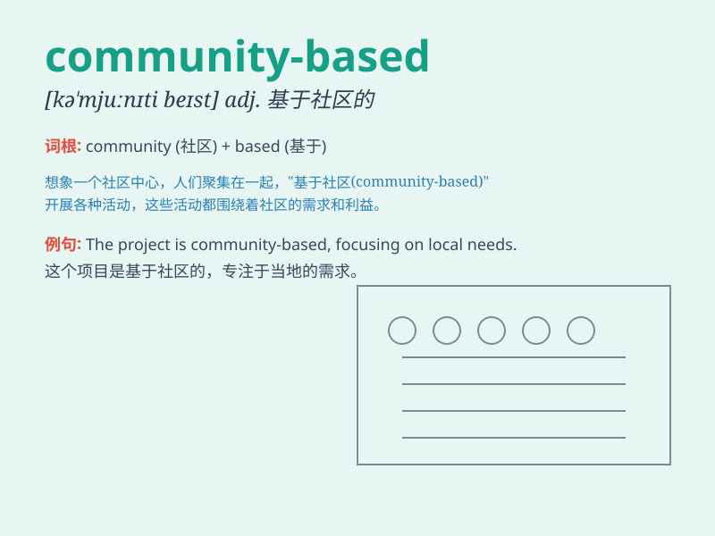

## community-based

**英音:** _[kəˈmjuːnɪti beɪst]_ **美音:** _[kəˈmjunəti
beɪst]_

**译义:** *基于社区的；以社区为基础的*

### 短语

+ **community-based organization:** _基于社区的组织_

+ **community-based care:** _社区为基础的护理_

+ **community-based project:** _以社区为基础的项目_

+ **community-based education:** _社区本位教育_

+ **community-based service:** _社区服务_

### 例句

#### 例句1

> **The organization promotes community-based healthcare
initiatives.**

**中文翻译:** 该组织推动基于社区的医疗保健计划。

**单词释义:** 基于社区的

#### 例句2

> **We need to develop more community-based educational programs.**

**中文翻译:** 我们需要开发更多基于社区的教育项目。

**单词释义:** 基于社区的

#### 例句3

> **The community-based project aims to improve local living
conditions.**

**中文翻译:** 这个基于社区的项目旨在改善当地的生活条件。

**单词释义:** 基于社区的

### 背诵小故事

> In a small town, there was a project. It was community-based, meaning
it relied on the efforts and resources of all the people living there.
Everyone worked together to make it successful, showing the power of a
united community.

**在一个小镇上，有一个项目。它是以社区为基础的，这意味着它依靠那里所有居民的努力和资源。每个人都共同努力使其成功，展示了一个团结社区的力量。**

### 图义

