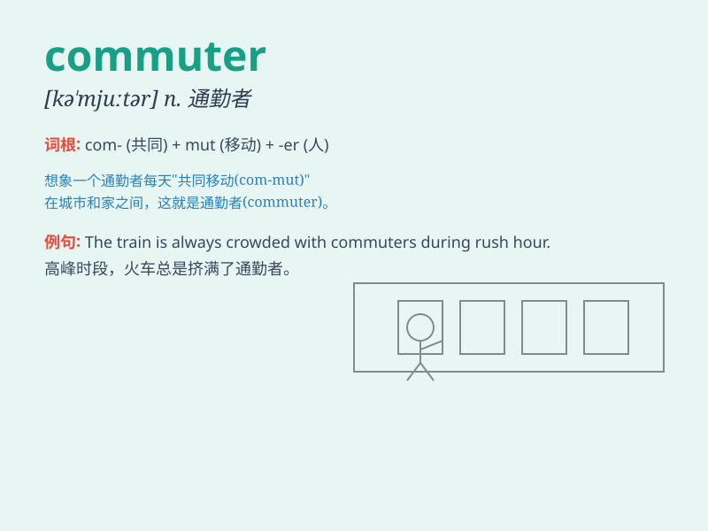

## commuter

**英音:** _[kə\'mjuːtə(r)]_ **美音:** _[kə\'mjʊtɚ]_

**译义:** *n.通勤者,经常往返者*

### 短语

+ **commuter train:** _通勤列车_

+ **commuter traffic:** _通勤交通_

+ **commuter route:** _通勤路线_

+ **commuter belt:** _通勤带_

+ **daily commuter:** _每日通勤者_

### 例句

#### 例句1

> **The commuter was tired after a long day at work.**

**中文翻译:** 经过一整天的工作后，通勤者感到很累。

**单词释义:** 通勤者

#### 例句2

> **The commuter train was crowded during rush hour.**

**中文翻译:** 高峰时段，通勤列车非常拥挤。

**单词释义:** 通勤者；通勤火车

#### 例句3

> **She is a regular commuter between the two cities.**

**中文翻译:** 她是两个城市之间的定期通勤者。

**单词释义:** 通勤者

### 背诵小故事

> John works in the city but lives in the suburbs. Every day, he takes
the train to and from work. John is a typical commuter, spending hours
traveling between home and office.

**约翰在城市工作但住在郊区。每天，他乘火车上下班。约翰是一个典型的通勤者，花费数小时在家庭和办公室之间往返。**

### 图义

