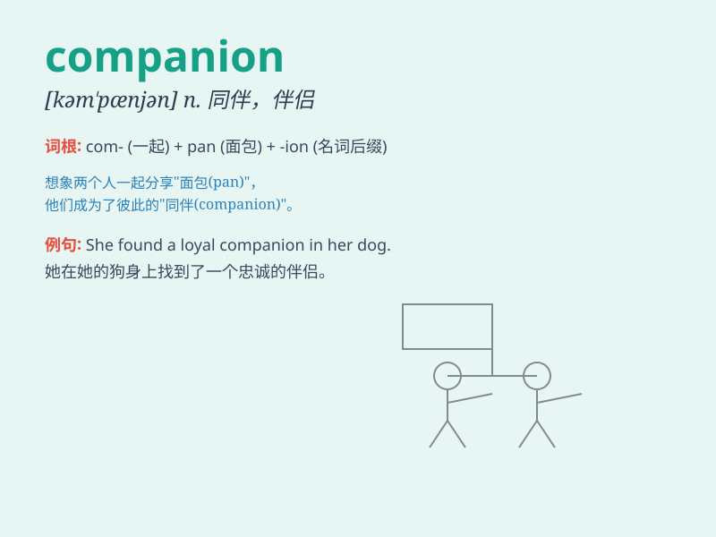

## companion

**英音:** _[kəm\'pænjən]_ **美音:** _[kəm\'pænɪən]_

**译义:** *n.同伴,共事者*

### 短语

+ **travel companion:** _旅行伙伴_

+ **companion volume:** _姊妹篇；配套卷_

+ **companion animal:** _宠物_

+ **close companion:** _亲密伙伴_

+ **faithful companion:** _忠实的伴侣_

### 例句

#### 例句1

> **She has been my constant companion throughout these difficult
times.**

**中文翻译:** 在这些困难时期，她一直是我忠实的伴侣。

**单词释义:** 伙伴；同伴

#### 例句2

> **The dog is a wonderful companion for the elderly.**

**中文翻译:** 狗是老年人的好伴侣。

**单词释义:** 伴侣

#### 例句3

> **He found a companion to share the journey with.**

**中文翻译:** 他找到了一个可以分享旅程的同伴。

**单词释义:** 同伴

### 背诵小故事

> Once upon a time, a lonely traveler was lost in a forest. Just when
he felt hopeless, a friendly dog appeared and became his companion. They
walked together and finally found the way out. The dog was a true friend
along the journey.

**从前，有一个孤独的旅行者在森林里迷路了。就在他感到绝望的时候，一只友好的狗出现了，并成为了他的同伴。他们一起走，最终找到了出路。这只狗在旅途中是真正的朋友。**

### 图义

