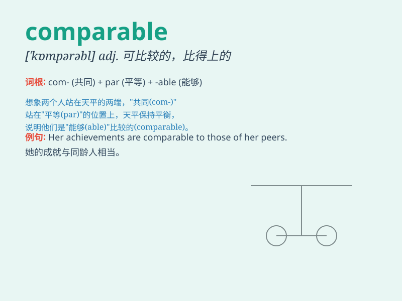

## comparable

**英音:** _[\'kɒmp(ə)rəb(ə)l]_ **美音:** _[\'kɑmpərəbl]_

**译义:** *adj.可比较的,比得上的*

### 短语

+ **comparable data:** _可比数据_

+ **comparable prices:** _可比价格_

+ **comparable performance:** _可比性能_

+ **comparable quality:** _可比质量_

+ **comparable products:** _可比产品_

### 例句

#### 例句1

> **The quality of this product is comparable to that of the leading
brand.**

**中文翻译:** 该产品的质量可与领先品牌相媲美。

**单词释义:** 比得上；可比较的

#### 例句2

> **Her salary is comparable with that of her colleagues.**

**中文翻译:** 她的工资与她的同事相当。

**单词释义:** 类似的；相当的

#### 例句3

> **The results of the two experiments are comparable within a
certain range.**

**中文翻译:** 两次实验的结果在一定范围内具有可比性。

**单词释义:** 可相比的

### 背诵小故事

> Once upon a time, there were two mountains. One was high and the
other was low. We could say the heights of them were comparable. It
means they could be compared and were similar in some aspects.

**从前，有两座山。一座高，另一座低。我们可以说它们的高度是可比较的。这意味着它们可以被比较并且在某些方面是相似的。**

### 图义

