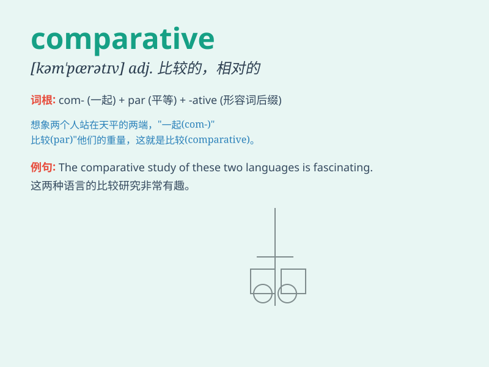

## comparative

**英音:** _[kəm\'pærətɪv]_ **美音:** _[kəm\'pærətɪv]_

**译义:** *adj.比较的,相当的*

### 短语

+ **comparative advantage:** _比较优势_

+ **comparative literature:** _比较文学_

+ **comparative method:** _比较法_

+ **comparative linguistics:** _比较语言学_

+ **comparative degree:** _比较级_

### 例句

#### 例句1

> **The comparative study showed significant differences between the
two methods.**

**中文翻译:** 比较研究表明两种方法之间存在显着差异。

**单词释义:** 比较的

#### 例句2

> **She made a comparative analysis of the two novels.**

**中文翻译:** 她对两部小说进行了比较分析。

**单词释义:** 比较的

#### 例句3

> **In comparative terms, this house is more expensive than the one
next door.**

**中文翻译:** 相比较而言，这栋房子比隔壁的贵。

**单词释义:** 相对的；比较而言的

### 背诵小故事

> A king wanted to know which of his two castles was better. So, he
made a comparative study. He looked at size, beauty, and comfort.
Finally, he found the differences and chose the better one.

**一位国王想知道他的两座城堡哪一个更好。于是，他进行了一项比较研究。他查看了大小、美观和舒适度。最后，他发现了差异并选出了更好的那一个。**

### 图义

