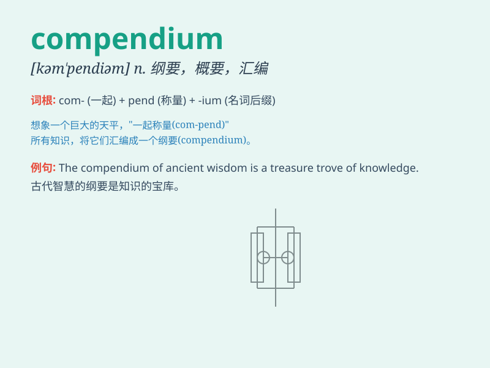

## compendium

**英音:** _[kəm\'pendɪəm]_ **美音:** _[kəm\'pɛndɪəm]_

**译义:** *n.纲要,概略*

### 短语

+ **compendium of knowledge:** _知识纲要_

+ **compendium report:** _综合报告_

+ **compendium volume:** _简编卷册_

+ **historical compendium:** _历史概要_

+ **medical compendium:** _医学纲要_

### 例句

#### 例句1

> **The book is a compendium of ancient history.**

**中文翻译:** 该书是古代历史的概要。

**单词释义:** 纲要；概略

#### 例句2

> **She presented a compendium of the research findings.**

**中文翻译:** 她介绍了研究结果的概要。

**单词释义:** 概要；简编

#### 例句3

> **The museum has a compendium of local artworks.**

**中文翻译:** 博物馆收藏了当地艺术品。

**单词释义:** 汇集；大全

### 背诵小故事

> A brave explorer was lost in a strange land. He found a compendium
that held all the essential knowledge and maps to guide him home. The
compendium was like a magical key to survival.

**一位勇敢的探险家在陌生的土地上迷路了。他发现了一本纲要，里面包含了所有必要的知识和地图来指引他回家。这本纲要就像是生存的神奇钥匙。**

### 图义

