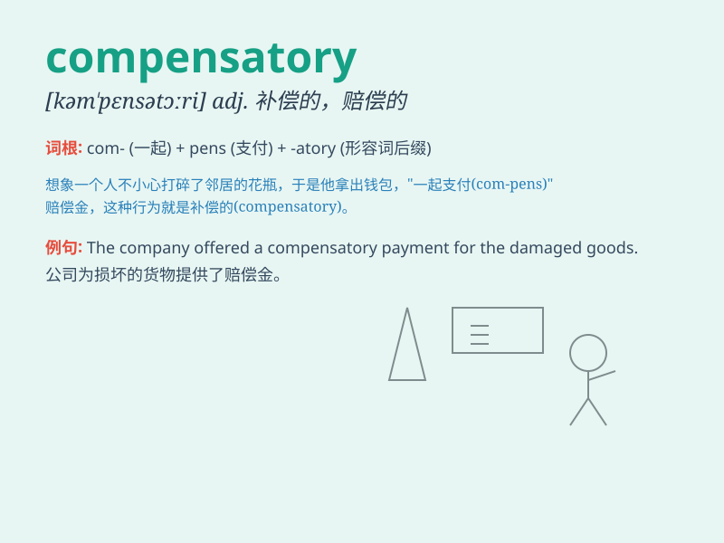

## compensatory

**英音:** _[kɒmpen\'seɪtərɪ]_ **美音:**
_[kəm\'pɛnsə,tori]_

**译义:** *adj.补偿性的*

### 短语

+ **compensatory damages:** _补偿性损害赔偿金_

+ **compensatory mechanism:** _补偿机制_

+ **compensatory time off:** _补休_

+ **compensatory payment:** _补偿款_

+ **compensatory education:** _补偿教育_

### 例句

#### 例句1

> **The company offered compensatory damages for the mistake.**

**中文翻译:** 该公司为这一错误提供了赔偿。

**单词释义:** 补偿性的

#### 例句2

> **She received compensatory time off for working overtime.**

**中文翻译:** 她因加班而获得了补休。

**单词释义:** 补偿性的

#### 例句3

> **The compensatory measures were not enough to solve the
problem.**

**中文翻译:** 补偿措施不足以解决问题。

**单词释义:** 补偿的

### 背诵小故事

> A poor man lost his job. But he got compensatory money from the
company. With this, he could pay his bills and start a new life. So,
compensatory means providing something to make up for a loss or damage.

**一个穷人丢了工作。但他从公司得到了补偿款。有了这笔钱，他能支付账单并开始新生活。所以，compensatory
意思是补偿性的，用以弥补损失或损害。**

### 图义

