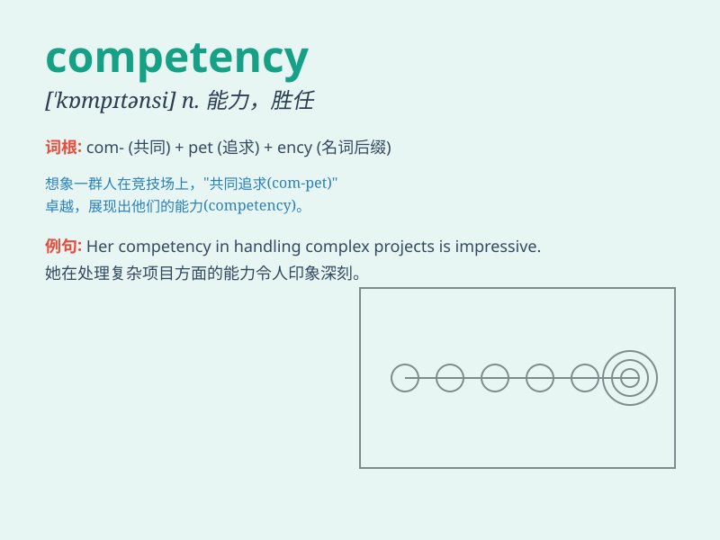

## competency

**英音:** _[\'kɒmpɪtənsɪ]_ **美音:** _[\'kɑmpɪtənsi]_

**译义:** *n.资格,能力,[律]作证能力*

### 短语

+ **core competency:** _核心竞争力_

+ **professional competency:** _专业能力_

+ **technical competency:** _技术能力_

+ **managerial competency:** _管理能力_

+ **competency assessment:** _能力评估_

### 例句

#### 例句1

> **The new employee demonstrated high competency in handling
customer complaints.**

**中文翻译:** 这位新员工在处理客户投诉方面表现出了很高的能力。

**单词释义:** 能力；技能

#### 例句2

> **We need to assess the competency of the candidates before making
a hiring decision.**

**中文翻译:** 在做出聘用决定之前，我们需要评估候选人的能力。

**单词释义:** 能力；胜任力

#### 例句3

> **Her Competency in multiple languages gave her an advantage in the
international job market.**

**中文翻译:** 她的多种语言能力使她在国际就业市场上具有优势。

**单词释义:** 能力；才能

### 背诵小故事

> A young athlete was determined to prove his competency in the sports
field. He trained hard every day, facing challenges and never giving up.
Finally, he won the championship and showed his true Competency.

**一位年轻的运动员决心在运动场上证明自己的能力。他每天刻苦训练，面对挑战从不放弃。最终，他赢得了冠军，展示了自己真正的能力。**

### 图义

