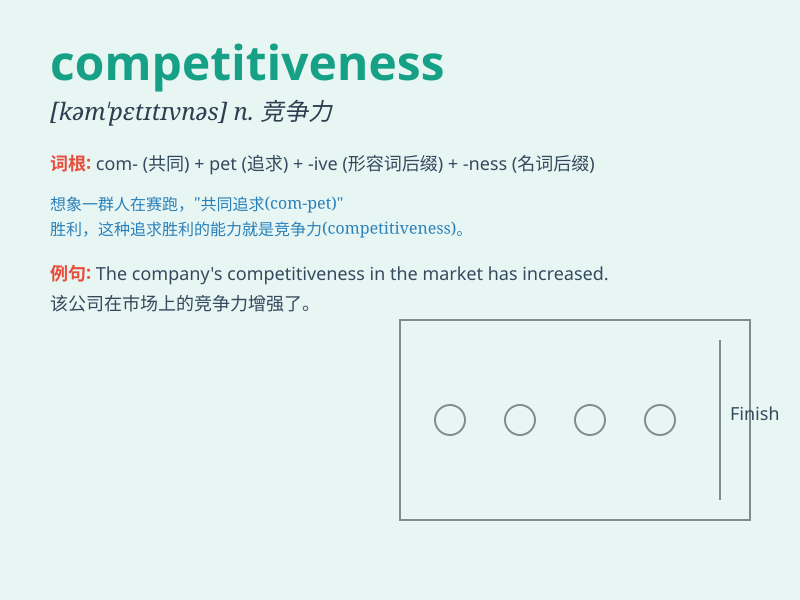

## competitiveness

**英音:** _[kəm\'petɪtɪvnəs]_ **美音:**
_[kəm\'petɪtɪvnəs]_

**译义:** *n. 竞争力；竞争能力*

### 短语

+ **market competitiveness:** _市场竞争力_

+ **enhance competitiveness:** _增强竞争力_

+ **competitiveness analysis:** _竞争力分析_

+ **global competitiveness:** _全球竞争力_

+ **competitiveness advantage:** _竞争优势_

### 例句

#### 例句1

> **The company\'s competitiveness in the market has significantly
improved due to its innovative products.**

**中文翻译:** 由于其创新产品，该公司在市场上的竞争力显著提高。

**单词释义:** 竞争力

#### 例句2

> **In order to enhance the competitiveness of the country\'s
economy, the government has implemented a series of policies.**

**中文翻译:** 为了增强该国经济的竞争力，政府实施了一系列政策。

**单词释义:** 竞争力

#### 例句3

> **The competitiveness among students for top grades is intense.**

**中文翻译:** 学生们为取得高分的竞争很激烈。

**单词释义:** 竞争；竞争力

### 背诵小故事

> In a magical forest, animals held a race. Each one wanted to show
their competitiveness. The rabbit ran fast, the monkey climbed high.
They all tried their best to win. In the end, it was about who was more
determined and skilled.

**在一个神奇的森林里，动物们举行了一场比赛。每一个都想展现自己的竞争力。兔子跑得很快，猴子爬得很高。它们都尽全力去赢。最后，就看谁更坚定和有技巧。**

### 图义

