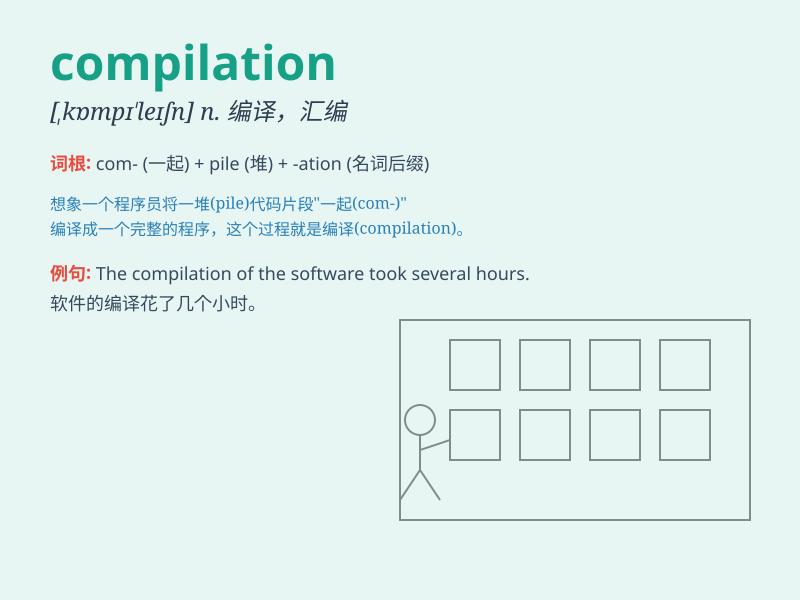

## compilation

**英音:** _[kɒmpɪ\'leɪʃ(ə)n]_ **美音:**
_[,kɑmpɪ\'leʃən]_

**译义:** *n.编辑*

### 短语

+ **compilation album:** _精选集_

+ **compilation process:** _编译过程_

+ **data compilation:** _数据汇编_

+ **code compilation:** _代码编译_

+ **compilation error:** _编译错误_

### 例句

#### 例句1

> **The compilation of this dictionary took several years.**

**中文翻译:** 这本词典的编撰历时数年。

**单词释义:** 编纂；编写

#### 例句2

> **The compilation of data for the report was a complex task.**

**中文翻译:** 报告数据的汇编是一项复杂的任务。

**单词释义:** 收集；汇集

#### 例句3

> **This album is a compilation of their greatest hits.**

**中文翻译:** 这张专辑收录了他们最热门的歌曲。

**单词释义:** 合集；合辑

### 背诵小故事

> A group of students were assigned the task of compilation. They had
to collect and organize various data for a project. It was like putting
pieces of a puzzle together to form a complete and useful collection.

**一组学生被分配了编译的任务。他们必须为一个项目收集和整理各种数据。这就像把拼图的碎片拼在一起，形成一个完整且有用的集合。**

### 图义

