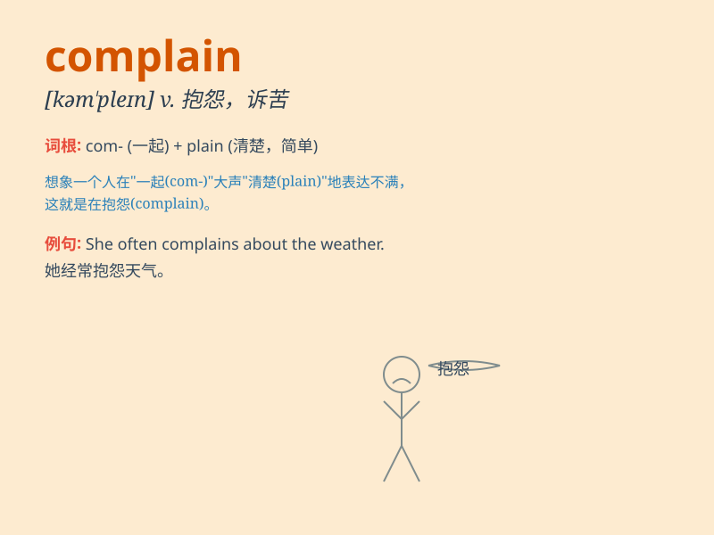

## complain

**英音:** _[kəm\'pleɪn]_ **美音:** _[kəm\'plen]_

**译义:** *v.抱怨,悲叹,控诉*

### 短语

+ **complain about:** _抱怨；投诉_

+ **complain of:** _诉说（病痛等）_

+ **complain to:** _向\...\...抱怨_

+ **never complain:** _从不抱怨_

+ **constantly complain:** _不停地抱怨_

### 例句

#### 例句1

> **She always complains about the long working hours.**

**中文翻译:** 她总是抱怨工作时间太长。

**单词释义:** 抱怨

#### 例句2

> **The customers complained that the service was poor.**

**中文翻译:** 顾客抱怨服务很差。

**单词释义:** 抱怨

#### 例句3

> **He never complains when he has to do extra work.**

**中文翻译:** 当他必须做额外的工作时，他从不抱怨。

**单词释义:** 抱怨

### 背诵小故事

> One day, Tom was very unhappy. He had a lot of problems at work. So
he decided to complain to his friend. He said, \'I\'m so tired of all
these difficulties.\' This shows the act of expressing dissatisfaction,
which is what \'complain\' means.

**有一天，汤姆非常不开心。他在工作中有很多问题。所以他决定向他的朋友抱怨。他说：'我受够了所有这些难题。'
这展示了表达不满的行为，这就是'complain'的意思。**

### 图义

