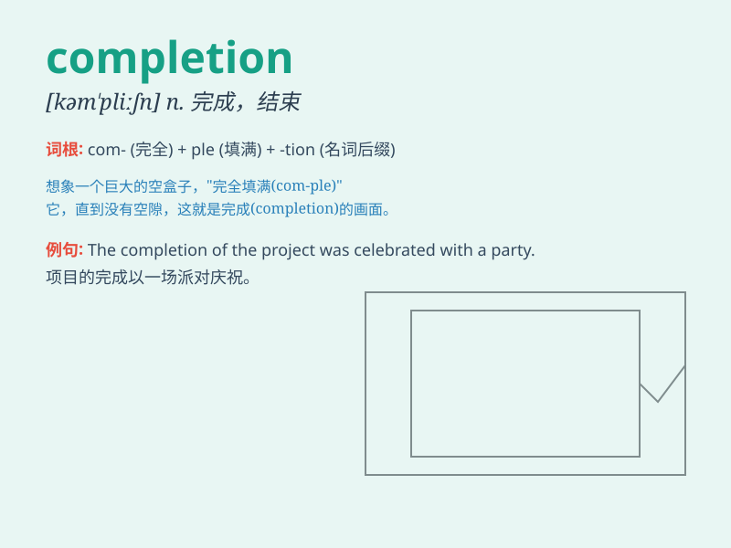

## completion

**英音:** _[kəm\'pliːʃn]_ **美音:** _[kəm\'pliʃən]_

**译义:** *n.完成*

### 短语

+ **job completion:** _工作完成_

+ **project completion:** _项目完成_

+ **course completion:** _课程完成_

+ **task completion:** _任务完成_

+ **degree completion:** _学位完成_

### 例句

#### 例句1

> **The project is nearing completion.**

**中文翻译:** 这个项目接近完成。

**单词释义:** 完成；结束

#### 例句2

> **The completion of this task requires teamwork.**

**中文翻译:** 完成这项任务需要团队合作。

**单词释义:** 完成

#### 例句3

> **She felt a great sense of satisfaction upon the completion of her
thesis.**

**中文翻译:** 她在论文完成时感到一种极大的满足感。

**单词释义:** 完成

### 背诵小故事

> A student was working hard to finish a difficult project. After many
days of effort, he finally reached the completion. It felt like a huge
achievement and he was very happy.

**一名学生努力完成一项困难的项目。经过多日的努力，他终于达成了完工。这感觉像是一项巨大的成就，他非常高兴。**

### 图义

