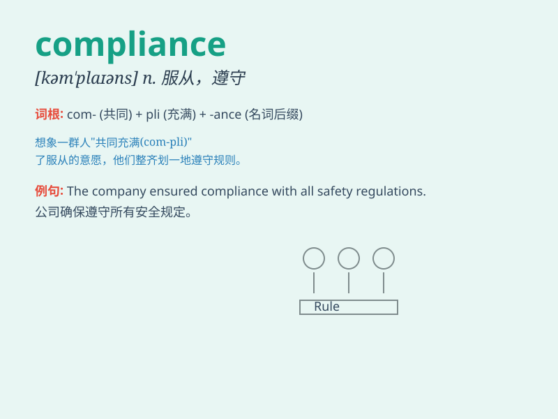

## compliance

**英音:** _[kəm\'plaɪəns]_ **美音:** _[kəm\'plaɪəns]_

**译义:** *n.依从,顺从*

### 短语

+ **in compliance with:** _依从；符合；遵照_

+ **compliance officer:** _合规官；合规专员_

+ **regulatory compliance:** _法规遵从；合规性监管_

+ **compliance department:** _合规部门_

+ **compliance cost:** _合规成本_

### 例句

#### 例句1

> **The company ensures compliance with all relevant laws and
regulations.**

**中文翻译:** 这家公司确保遵守所有相关的法律法规。

**单词释义:** 遵守

#### 例句2

> **His compliance with her demands was unexpected.**

**中文翻译:** 他对她的要求的顺从出人意料。

**单词释义:** 顺从

#### 例句3

> **The new system was designed to improve compliance among
employees.**

**中文翻译:** 新系统旨在提高员工的依从性。

**单词释义:** 依从

### 背诵小故事

> A company was in danger of being shut down due to non-compliance with
safety regulations. But after they strictly followed the rules, they
achieved compliance and were saved.

**一家公司由于不遵守安全规定而面临被关闭的危险。但在他们严格遵循规则后，实现了合规，从而得救。**

### 图义

