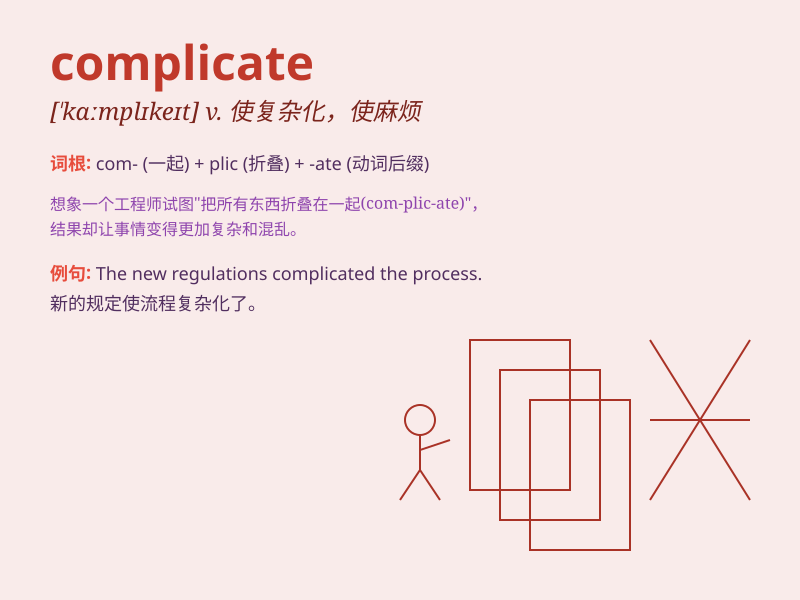

## complicate

**英音:** _[\'kɒmplɪkeɪt]_ **美音:** _[\'kɑmplɪket]_

**译义:** *v.(使)变复杂*

### 短语

+ **complicate matters:** _使事情复杂化_

+ **complicate the issue:** _使问题复杂化_

+ **further complicate:** _进一步使复杂_

+ **complicate the situation:** _使局势复杂化_

+ **greatly complicate:** _极大地使复杂_

### 例句

#### 例句1

> **The new regulations will complicate the process of getting a
loan.**

**中文翻译:** 新的规定将会使获得贷款的过程变得复杂。

**单词释义:** 使复杂

#### 例句2

> **Don\'t complicate a simple problem.**

**中文翻译:** 别把一个简单的问题弄复杂了。

**单词释义:** 使变得复杂

#### 例句3

> **His arrival complicated matters further.**

**中文翻译:** 他的到来使事情进一步复杂化了。

**单词释义:** 使复杂化

### 背诵小故事

> A simple math problem was made to complicate when the teacher added
many extra conditions. The students struggled to solve it. Now you know
complicate means to make something more complex or difficult.

**一道简单的数学题在老师添加了许多额外条件后变得复杂了。学生们努力去解答。现在你知道complicate意思是使某物更复杂或困难。**

### 图义

