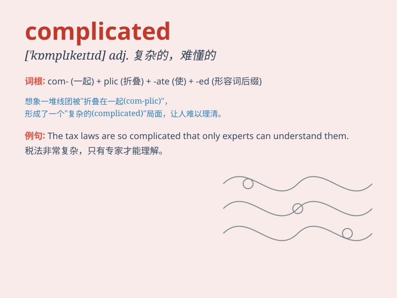

## complicated

**英音:** _[\'kɒmplɪkeɪtɪd]_ **美音:** _[\'kɑmplɪketɪd]_

**译义:** *adj.复杂的,难解的*

### 短语

+ **complicated problem:** _复杂的问题_

+ **complicated situation:** _复杂的情况_

+ **complicated relationship:** _复杂的关系_

+ **complicated process:** _复杂的过程_

+ **complicated system:** _复杂的系统_

### 例句

#### 例句1

> **The math problem is very complicated and I need more time to
solve it.**

**中文翻译:** 这道数学题非常复杂，我需要更多时间来解答。

**单词释义:** 复杂的

#### 例句2

> **The relationship between them is quite complicated.**

**中文翻译:** 他们之间的关系相当复杂。

**单词释义:** 复杂的

#### 例句3

> **The instructions for assembling the furniture are so complicated
that I\'m confused.**

**中文翻译:** 组装家具的说明如此复杂，以至于我感到困惑。

**单词释义:** 复杂的；难懂的

### 背诵小故事

> A young detective was solving a case. The clues were all over the
place and very complicated. But with patience and sharp thinking, he
finally untangled the mess. It was like finding the way out of a complex
maze.

**一位年轻的侦探正在破案。线索到处都是，非常复杂。但凭借耐心和敏锐的思考，他最终理清了头绪。这就像从一个复杂的迷宫中找到出路。**

### 图义

