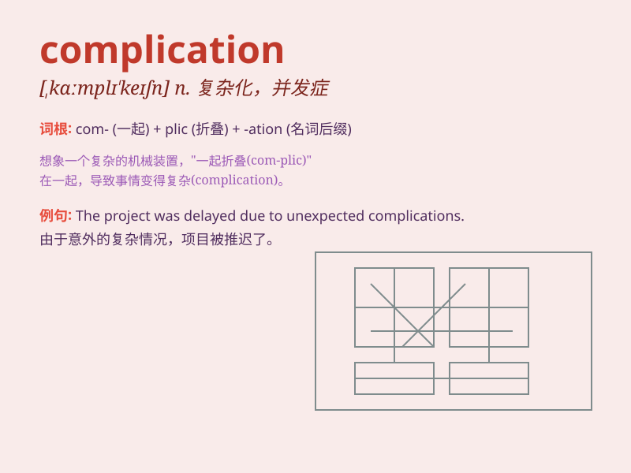

## complication

**英音:** _[kɒmplɪ\'keɪʃ(ə)n]_ **美音:**
_[,kɑmplɪ\'keʃən]_

**译义:** *n.复杂化,(使复杂的)因素n.[医]并发症*

### 短语

+ **complication of disease:** _疾病的并发症_

+ **avoid complication:** _避免并发症_

+ **potential complication:** _潜在的并发症_

+ **serious complication:** _严重的并发症_

+ **postoperative complication:** _术后并发症_

### 例句

#### 例句1

> **The surgery had some complications, but the patient eventually
recovered.**

**中文翻译:** 这场手术出现了一些并发症，但病人最终康复了。

**单词释义:** （疾病或手术的）并发症

#### 例句2

> **The project faced several complications due to unforeseen
circumstances.**

**中文翻译:** 由于不可预见的情况，这个项目面临了几个复杂情况。

**单词释义:** 复杂情况；难题

#### 例句3

> **His late arrival was just another complication in our already
busy day.**

**中文翻译:** 他的迟到在我们本就忙碌的一天中只是又一个麻烦。

**单词释义:** 麻烦；使更复杂的因素

### 背诵小故事

> A doctor was treating a patient. After the surgery, an unexpected
problem appeared - a complication. It made the patient\'s recovery more
difficult. The doctor had to find a new way to solve it.

**一位医生正在治疗一位病人。手术后，出现了一个意想不到的问题------并发症。这使得病人的康复更加困难。医生不得不寻找新的方法来解决它。**

### 图义

