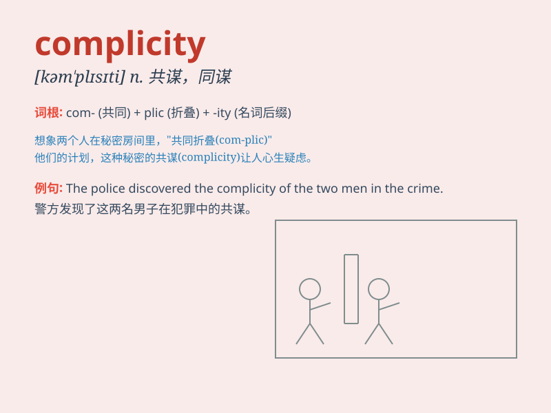

## complicity

**英音:** _[kəm\'plɪsɪtɪ]_ **美音:** _[kəm\'plɪsəti]_

**译义:** *n.同谋,共犯*

### 短语

+ **in complicity with:** _与\...同谋_

+ **act of complicity:** _共谋行为_

+ **complicity in crime:** _犯罪共谋_

+ **degree of complicity:** _共谋程度_

+ **reveal complicity:** _揭露共谋_

### 例句

#### 例句1

> **He was accused of complicity in the robbery.**

**中文翻译:** 他被指控参与了这起抢劫案。

**单词释义:** 同谋；共犯关系

#### 例句2

> **There was no evidence of her complicity in the crime.**

**中文翻译:** 没有证据表明她与该犯罪有牵连。

**单词释义:** 牵连；参与犯罪

#### 例句3

> **The manager\'s complicity in the fraud was exposed.**

**中文翻译:** 经理在欺诈案中的共谋行为被曝光了。

**单词释义:** 共谋；串通

### 背诵小故事

> A thief was stealing jewels. His partner, who provided tools and a
lookout, was involved in the complicity. They thought they could get
away with it, but eventually the police caught them both.

**一个小偷正在偷珠宝。他的伙伴，提供工具并放风，参与了同谋。他们以为能逃脱，但最终警察把他们俩都抓住了。**

### 图义

