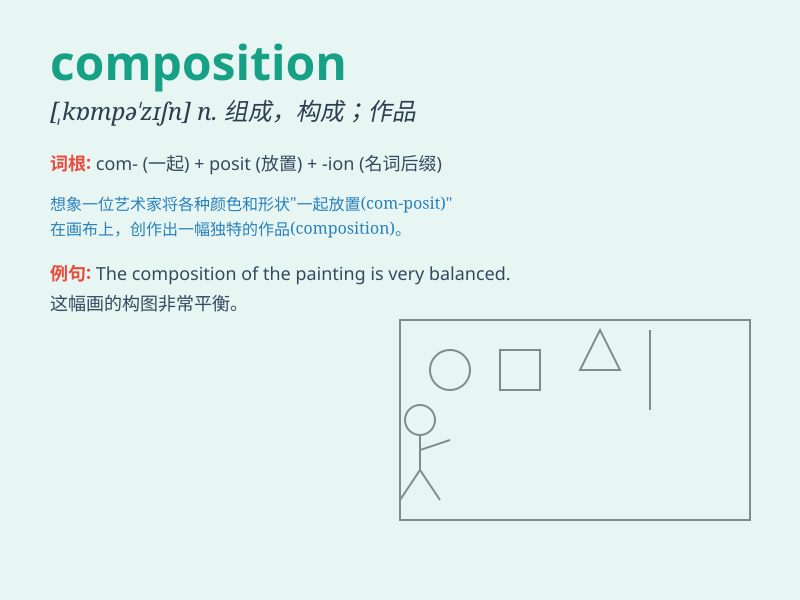

## composition

**英音:** _[ˌkɒmpəˈzɪʃn]_ **美音:** _[,kɑmpə\'zɪʃən]_

**译义:** *n.写作,作文,成分,合成物*

### 短语

+ **musical composition:** _音乐作品_

+ **composition of forces:** _力的合成_

+ **essay composition:** _作文写作_

+ **composition of matter:** _物质组成_

+ **artistic composition:** _艺术构图_

### 例句

#### 例句1

> **The composition of this painting is very unique.**

**中文翻译:** 这幅画的构图非常独特。

**单词释义:** 构图

#### 例句2

> **Her composition on the environment was excellent.**

**中文翻译:** 她关于环境的作文非常棒。

**单词释义:** 作文

#### 例句3

> **The composition of the team has changed a lot.**

**中文翻译:** 团队的构成发生了很大的变化。

**单词释义:** 组成

### 背诵小故事

> A little monkey was asked to write a composition about his adventure
in the forest. He struggled at first but finally composed a wonderful
story. The composition was full of excitement and fun.

**一只小猴子被要求写一篇关于它在森林里冒险的作文。它一开始很挣扎，但最终创作了一篇精彩的故事。这篇作文充满了刺激和乐趣。**

### 图义

