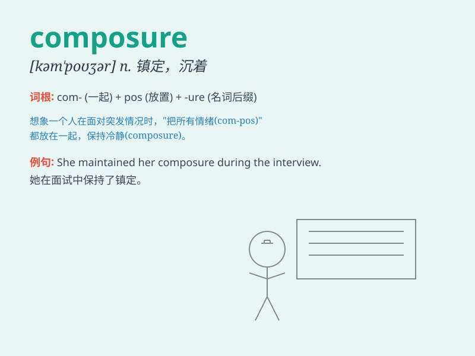

## composure

**英音:** _[kəmˈpəʊʒə(r)]_ **美音:** _[kəmˈpoʊʒər]_

**译义:** *n.镇静,沉着*

### 短语

+ **keep one\'s composure:** _保持镇静；保持沉着_

+ **lose composure:** _失去镇静；失去沉着_

+ **regain composure:** _重新恢复镇静；重新恢复沉着_

+ **composure of mind:** _心境沉着_

+ **with composure:** _沉着地；镇定地_

### 例句

#### 例句1

> **She maintained her composure throughout the difficult
interview.**

**中文翻译:** 在整个艰难的采访过程中，她始终保持着冷静。

**单词释义:** 镇定；沉着；冷静

#### 例句2

> **Despite the chaos, he managed to regain his composure.**

**中文翻译:** 尽管一片混乱，他还是设法恢复了平静。

**单词释义:** 沉着；冷静

#### 例句3

> **His composure was shaken by the unexpected news.**

**中文翻译:** 突如其来的消息让他的镇静动摇了。

**单词释义:** 镇定；沉着

### 背诵小故事

> A king was in a dangerous battle but kept his composure. He didn\'t
panic and calmly gave orders, which led to their victory. Composure
means the state of being calm and in control of your feelings and
reactions.

**一位国王身处危险的战斗中但保持沉着。他没有惊慌，冷静地下达命令，最终取得了胜利。composure
意思是沉着冷静，能控制自己的感情和反应的状态。**

### 图义

