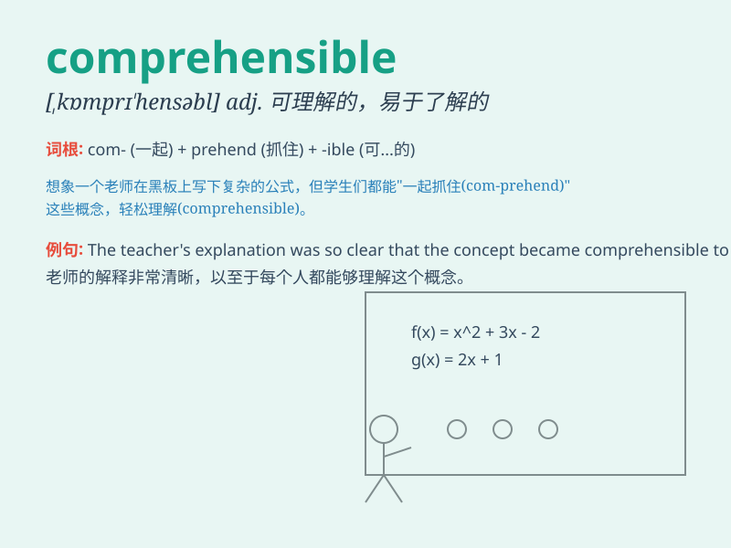

## comprehensible

**英音:** _[kɒmprɪ\'hensɪb(ə)l]_ **美音:**
_[\'kɑmprɪ\'hɛnsəbl]_

**译义:** *adj.可理解的,易于了解的*

### 短语

+ **be comprehensible to:** _为\...\...所理解_

+ **make something comprehensible:** _使某物易于理解_

+ **comprehensible explanation:** _可理解的解释_

+ **comprehensible language:** _易懂的语言_

+ **comprehensible text:** _可理解的文本_

### 例句

#### 例句1

> **The instructions were written in comprehensible language.**

**中文翻译:** 这些说明是用易于理解的语言编写的。

**单词释义:** 易懂的

#### 例句2

> **His lecture was comprehensible even to beginners.**

**中文翻译:** 他的讲座即使是初学者也能理解。

**单词释义:** 能理解的

#### 例句3

> **The problem became comprehensible after some explanations.**

**中文翻译:** 经过一些解释后，问题就变得可以理解了。

**单词释义:** 可以理解的

### 背诵小故事

> A student was struggling to understand a complex math problem. But
when the teacher explained it clearly and simply, it became
comprehensible. The student was so happy to finally grasp the concept.

**一名学生正在努力理解一个复杂的数学问题。但当老师清晰、简单地解释后，它变得可以理解了。学生终于掌握了这个概念，非常高兴。**

### 图义

