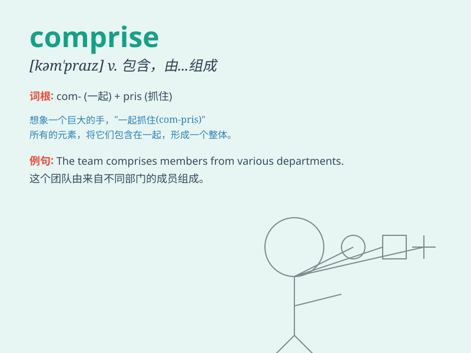

## comprise

**英音:** _[kəm\'praɪz]_ **美音:** _[kəm\'praɪz]_

**译义:** *v.包含,由\...组成*

### 短语

+ **be comprised of:** _由......组成_

+ **comprise elements:** _包含元素_

+ **comprise parts:** _包括部分_

+ **comprise a group:** _组成一个团体_

+ **comprise a variety:** _包含多种_

### 例句

#### 例句1

> **The committee comprises five members.**

**中文翻译:** 该委员会由五名成员组成。

**单词释义:** 由......组成

#### 例句2

> **The collection comprises 327 paintings.**

**中文翻译:** 该藏品包括 327 幅画作。

**单词释义:** 包括；包含

#### 例句3

> **Female students comprise 60% of the class.**

**中文翻译:** 班级中女生占60%。

**单词释义:** 构成；组成

### 背诵小故事

> 想象一个神秘的城堡，里面有各种房间和宝藏。这个城堡就叫
Comprise，它由（comprise）许多不同的部分组成，有高大的塔楼、宽敞的大厅、秘密的通道。这些部分一起构成了这个神奇的城堡。

**想象一个叫 Comprise 的城堡，它由许多不同部分组成，来辅助记忆单词
comprise 有'由......组成'的意思。**

### 图义

