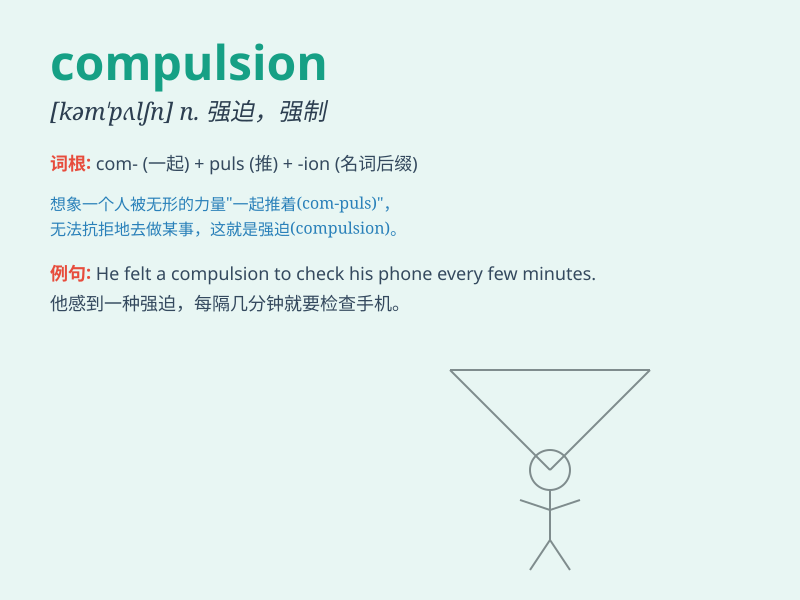

## compulsion

**英音:** _[kəm\'pʌlʃ(ə)n]_ **美音:** _[kəm\'pʌlʃən]_

**译义:** *n.强迫,强制,[心]强迫性冲动*

### 短语

+ **under compulsion:** _被迫，在强迫之下_

+ **feel a compulsion:** _感到一种强迫感_

+ **compulsion to do sth:** _做某事的强迫性_

+ **moral compulsion:** _道德上的强制_

+ **strong compulsion:** _强烈的强迫_

### 例句

#### 例句1

> **He felt a compulsion to check his phone every few minutes.**

**中文翻译:** 他感到有一种强迫症，每隔几分钟就要检查一次手机。

**单词释义:** 强烈的欲望；冲动

#### 例句2

> **She acted under compulsion and against her will.**

**中文翻译:** 她是在强迫和违背自己意愿的情况下行事的。

**单词释义:** 强迫；强制

#### 例句3

> **The compulsion to succeed drives him to work hard every day.**

**中文翻译:** 对成功的渴望驱使他每天努力工作。

**单词释义:** 难以抗拒的冲动；强烈的欲望

### 背诵小故事

> A man was constantly haunted by a strange thought. He had a
compulsion to count every step he took. No matter how hard he tried to
stop, he couldn\'t. This urge controlled his life.

**一个男人总是被一个奇怪的念头所困扰。他有一种强迫自己数每一步的冲动。无论他怎么努力去停止，都做不到。这种冲动控制了他的生活。**

### 图义

