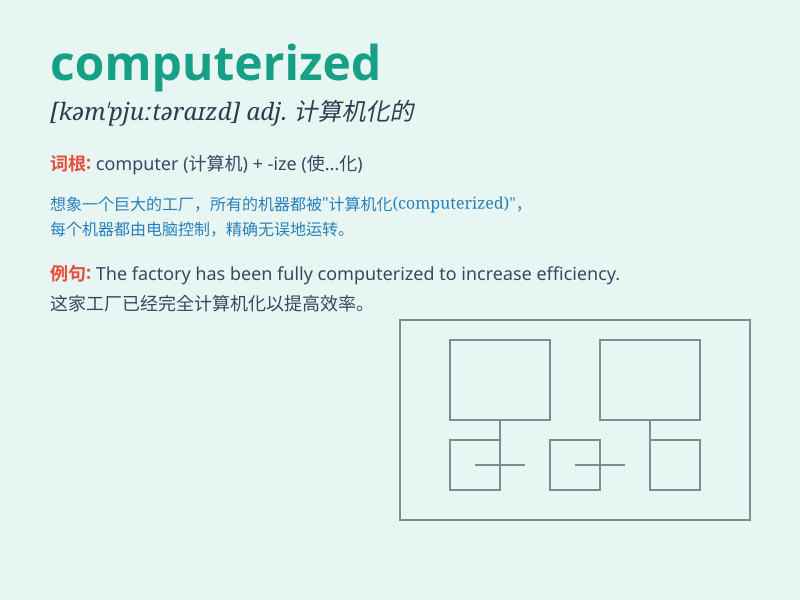

## computerized

**英音:** _[kəmˈpjuːtəraɪzd]_ **美音:**
_[kəmˈpjuːtəraɪzd]_

**译义:** *adj.计算机化的；电脑化的*

### 短语

+ **computerized system:** _计算机化系统_

+ **computerized tomography:** _计算机断层扫描_

+ **computerized accounting:** _计算机化会计_

+ **computerized control:** _计算机控制_

+ **computerized inventory:** _计算机化库存_

### 例句

#### 例句1

> **The factory has become fully computerized, increasing
productivity significantly.**

**中文翻译:** 这家工厂已经完全实现了计算机化，大大提高了生产力。

**单词释义:** 计算机化的

#### 例句2

> **The new computerized system makes our work more efficient.**

**中文翻译:** 新的计算机化系统使我们的工作更高效。

**单词释义:** 计算机化的

#### 例句3

> **The library has a computerized catalog to help you find books
easily.**

**中文翻译:** 图书馆有一个计算机化的目录，帮助你轻松找到书籍。

**单词释义:** 计算机化的

### 背诵小故事

> One day, I entered a mysterious room filled with advanced machines.
Everything was computerized. Lights turned on automatically, and doors
opened without a key. It was like a world controlled by computers.

**有一天，我进入了一个神秘的房间，里面充满了先进的机器。一切都是计算机化的。灯自动亮起，门无需钥匙就能打开。这就像是一个由计算机控制的世界。**

### 图义

