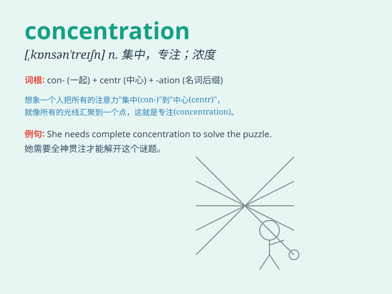

## concentration

**英音:** _[kɒns(ə)n\'treɪʃ(ə)n]_ **美音:**
_[\'kɑnsn\'treʃən]_

**译义:** *n.集中,集合,专心,浓缩,浓度*

### 短语

+ **concentration camp:** _集中营_

+ **concentration of power:** _权力集中_

+ **high concentration:** _高浓度_

+ **concentration on:** _专注于_

+ **mental concentration:** _精神集中_

### 例句

#### 例句1

> **I need total concentration to solve this difficult math
problem.**

**中文翻译:** 我需要全神贯注来解决这道数学难题。

**单词释义:** 全神贯注

#### 例句2

> **The concentration of salt in the solution is too high.**

**中文翻译:** 溶液中盐的浓度太高了。

**单词释义:** 浓度

#### 例句3

> **His concentration was broken by the sudden noise.**

**中文翻译:** 他的注意力被突然的噪音打断了。

**单词释义:** 注意力

### 背诵小故事

> A student was struggling to focus on his studies. But one day, he
decided to turn off his phone and sit in a quiet room. With great
effort, he achieved a high level of concentration and did well in his
exams.

**一个学生一直难以专注于学习。但有一天，他决定关掉手机，坐在一个安静的房间里。通过巨大的努力，他达到了高度的集中注意力，并在考试中取得了好成绩。**

### 图义

