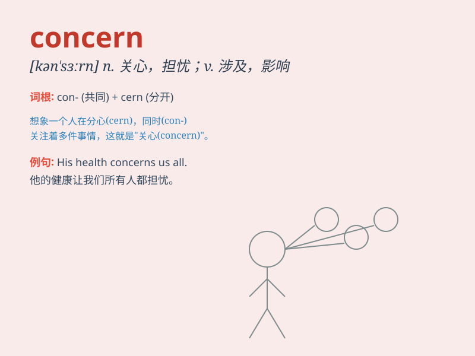

## concern

**英音:** _[kən\'sɜːn]_ **美音:** _[kən\'sɝn]_

**译义:** *vt.涉及,关系到n.(利害)关系,关心,关注,关注,所关心的是*

### 短语

+ **concern oneself with:** _忙于；关心；从事_

+ **as concerns:** _关于；至于_

+ **of concern:** _重要的；有意义的_

+ **concern about:** _对\...\...表示担心/忧虑_

+ **show concern for:** _对\...\...表示关心_

### 例句

#### 例句1

> **This issue concerns the safety of our community.**

**中文翻译:** 这个问题关系到我们社区的安全。

**单词释义:** 涉及；关系到

#### 例句2

> **His mother\'s health concerns him greatly.**

**中文翻译:** 他母亲的健康状况让他非常担心。

**单词释义:** 使担心；使挂念

#### 例句3

> **The company\'s main concern is to increase profits.**

**中文翻译:** 这家公司主要关心的是增加利润。

**单词释义:** 关心的事；重要的事

### 背诵小故事

> A little boy was lost in the forest. Everyone in the village was very
concerned. They searched everywhere until they found him. The boy\'s
safety was their main concern.

**一个小男孩在森林里迷路了。村里的每个人都非常担心。他们到处寻找，直到找到他。男孩的安全是他们主要的关心之事。**

### 图义

