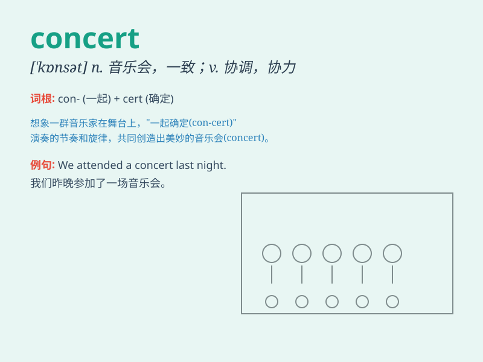

## concert

**英音:** _[\'kɒnsət]_ **美音:** _[\'kɑnsɚt]_

**译义:** *n.音乐会,一致*

### 短语

+ **pop concert:** _流行音乐会_

+ **classical concert:** _古典音乐会_

+ **give a concert:** _举办音乐会_

+ **attend a concert:** _参加音乐会_

+ **concert hall:** _音乐厅_

### 例句

#### 例句1

> **I went to a classical concert last night.**

**中文翻译:** 我昨晚去听了一场古典音乐会。

**单词释义:** 音乐会

#### 例句2

> **The band will give a concert in our city next month.**

**中文翻译:** 这个乐队下个月将在我们城市举办一场音乐会。

**单词释义:** 音乐会

#### 例句3

> **The concert was canceled due to bad weather.**

**中文翻译:** 由于天气恶劣，音乐会被取消了。

**单词释义:** 音乐会

### 背诵小故事

> A mouse wanted to enjoy a concert. It climbed into a big hall and saw
many people playing instruments. The beautiful music made the mouse
dance happily. \'Concert\' is a performance of music.

**一只老鼠想去欣赏一场音乐会。它爬进一个大礼堂，看到很多人在演奏乐器。美妙的音乐让老鼠开心地跳舞。\'concert\'就是音乐表演。**

### 图义

