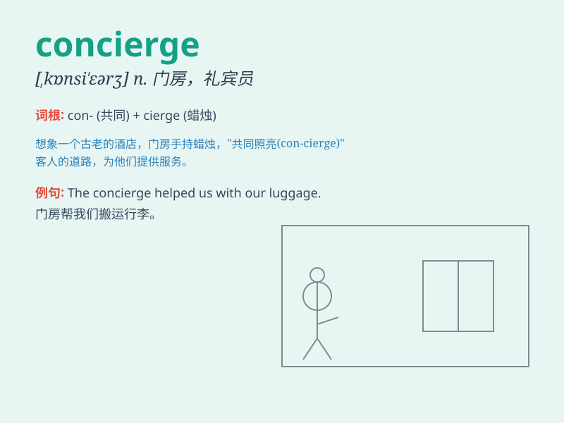

## concierge

**英音:** _[\'kɒnsɪeəʒ]_ **美音:** _[kɔn\'sjɛrʒ]_

**译义:** *n.看门人,门房*

### 短语

+ **hotel concierge:** _酒店礼宾员_

+ **concierge service:** _礼宾服务_

+ **apartment concierge:** _公寓管理员_

+ **concierge desk:** _礼宾台_

+ **building concierge:** _大楼管理员_

### 例句

#### 例句1

> **The concierge at the hotel was very helpful and friendly.**

**中文翻译:** 酒店的礼宾员非常乐于助人且友好。

**单词释义:** 礼宾员

#### 例句2

> **I asked the concierge for recommendations on local
restaurants.**

**中文翻译:** 我向礼宾员咨询当地餐厅的推荐。

**单词释义:** 礼宾员

#### 例句3

> **The concierge arranged for a taxi to pick us up at the
airport.**

**中文翻译:** 礼宾员安排了一辆出租车到机场接我们。

**单词释义:** 礼宾员

### 背诵小故事

> A tourist got lost in a big hotel. The concierge, a friendly and
helpful person, guided the tourist to the right place. The concierge is
like a helpful guide in a strange place.

**一位游客在一家大旅馆里迷路了。礼宾员，一个友好且乐于助人的人，引导游客去了正确的地方。礼宾员就像是在陌生地方的有用向导。**

### 图义

