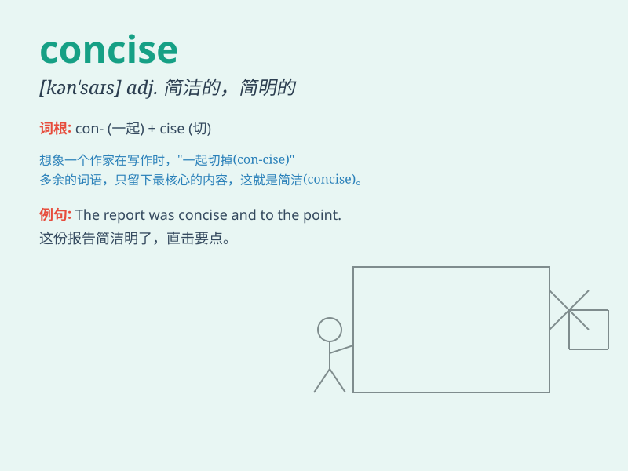

## concise

**英音:** _[kən\'saɪs]_ **美音:** _[kən\'saɪs]_

**译义:** *adj.简明的,简练的*

### 短语

+ **concise summary:** _简明的总结_

+ **concise statement:** _简洁的陈述_

+ **concise description:** _简洁的描述_

+ **concise explanation:** _简练的解释_

+ **concise report:** _简洁的报告_

### 例句

#### 例句1

> **The report was concise and to the point.**

**中文翻译:** 这份报告简洁明了且切中要点。

**单词释义:** 简洁的；简明的

#### 例句2

> **She gave a concise summary of the meeting.**

**中文翻译:** 她对会议作了一个简洁的总结。

**单词释义:** 简洁的；简明的

#### 例句3

> **His writing style is always very concise.**

**中文翻译:** 他的写作风格总是非常简洁。

**单词释义:** 简洁的；简明的

### 背诵小故事

> A king needed to send concise messages to his army quickly. So he
trained a special bird to carry short and clear words. With this, his
orders were always understood easily. \'Concise\' means short and clear.

**一位国王需要快速向他的军队发送简洁的消息。所以他训练了一只特殊的鸟来携带简短清晰的话语。因此，他的命令总是能被轻易理解。\'concise\'意思是简短清晰的。**

### 图义

